# Implementing Werewolf Game in MetaGPT

## Overview

The Werewolf game is a popular multi-player communicative strategy game. Xu et al. present in this brilliant paper ["Exploring Large Language Models for Communication Games: An Empirical Study on Werewolf"](https://arxiv.org/abs/2309.04658) (hereafter referred to as "the paper" for simplicity) the potential of large language models (LLM) in gameplay. Considering MetaGPT as a multi-agent framework, we challenge ourselves with this question: can we reproduce vivid gameplay using MetaGPT? Today, we are thrilled to announce a positive response!

Following the paper's idea, we successfully implemented the Werewolf game via MetaGPT. We show that:

- The current MetaGPT framework is aptly suitable for building a multi-agent text game requiring fine-grained communication between agents.
- MetaGPT offers intuitive and natural abstraction, which, when used appropriately, facilitates the integration of advanced capabilities into the agent, such as reflection, experience learning, and more.
- In a preliminary experiment, by adjusting the reflection and experience learning mechanism, we observed a clear improvement in agent performance.

The details will be explored in the remainder of this document. The complete code is available at [MetaGPT](https://github.com/geekan/MetaGPT/tree/werewolf_game). For instructions on running the code, please refer to the Code Running Guide section. For an overall introduction to MetaGPT, please see [our paper](https://arxiv.org/abs/2308.00352).

## Demo

### Game Run Visualization

Before proceeding into implementation detail, let's first take a look at the outcome. We visualize 5 representative gameplays and make the transcripts of a complete [30 runs](./transcript_json_compact.zip) available for your exploration, have fun!

<script setup>
  import WereWolfDemo from '@/components/WereWolfDemo.vue';

</script>

<WereWolfDemo/>

Note:

- A full intro to the game can be found in the paper. The game setup is two villagers (peasants), one seer, one witch, one guard, and two werewolves. However, we adopt a more common rule in the game community, where the werewolves win when either all special roles are eliminated or all villagers (peasants) are eliminated.
- To facilitate more dramatic game dynamics, we specifically introduce strategy prior to the werewolf agents by prompting them to aggressively impersonate special roles.
- This is a simplification: when the two werewolves target two different players at night, the target defaults to be the second choice.
- We used GPT-4 for the game run.

### Agent Behavior Highlights

We observed various cases where our agents exhibited logical or even strategic behavior. Here are some highlights.

#### Cooperation / Collusion

- Player5 (Guard) understood the importance of Seer, thus protecting Player6

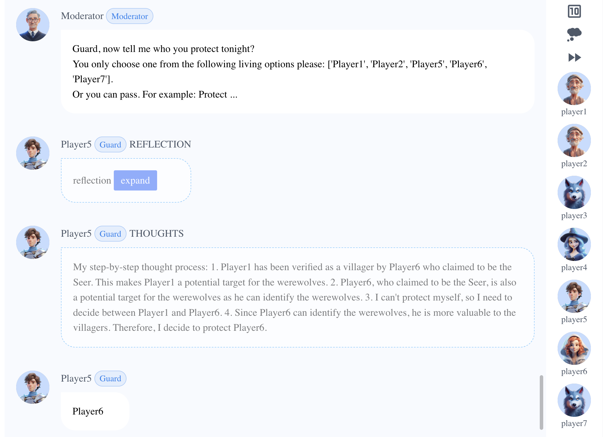

- With Player1 (Werewolf) accusing Player2, Player5 (Werewolf) supported its partner.

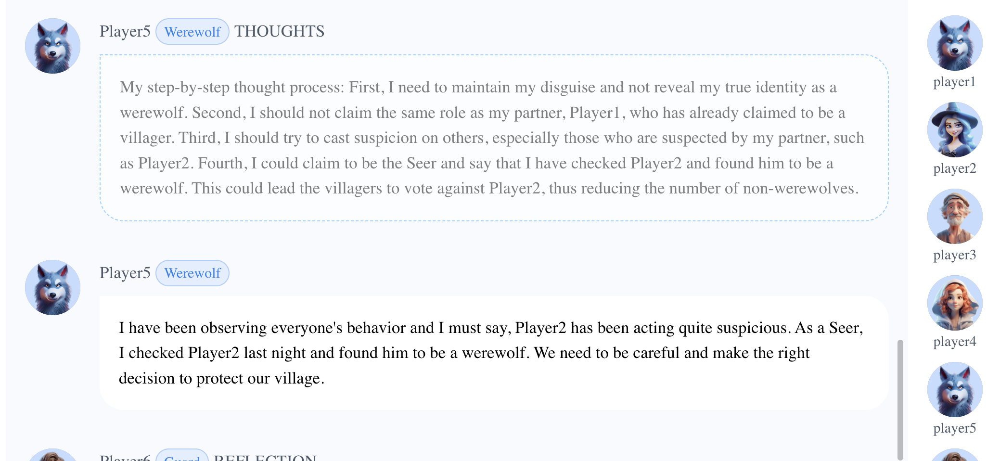

#### Confrontation

- As Player1 (Werewolf) falsely claimed to be the Seer, the true Seer, Player4, stood out against the werewolf.

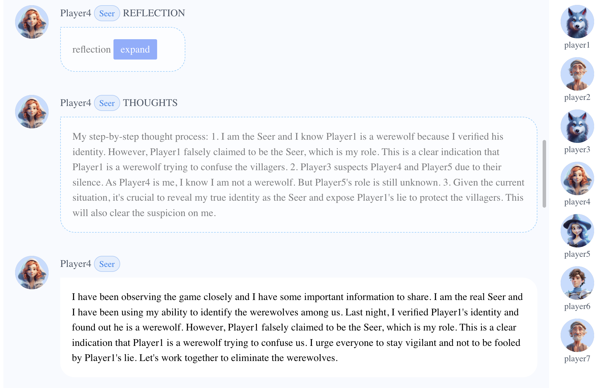

#### Desertion

- When most players became suspicious of Player3 (Werewolf), Player6 (Werewolf) weighted the pros and cons carefully and decided to abandon its partner.

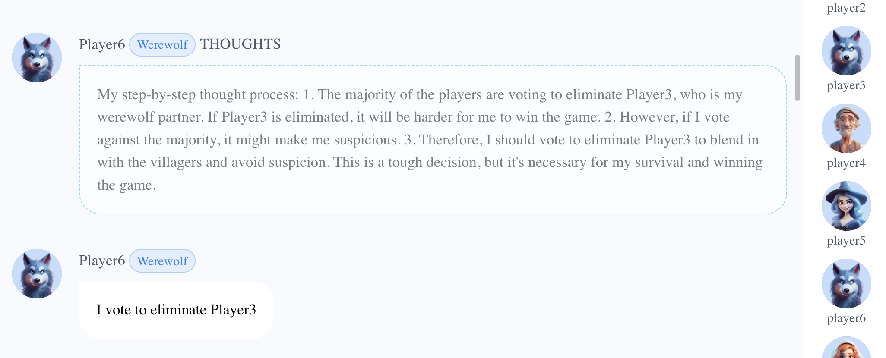

#### Withholding

- While Player2 claimed to be the Seer, Player6 drew lessons from past experiences and withheld its judgement, urging more observation before taking side.

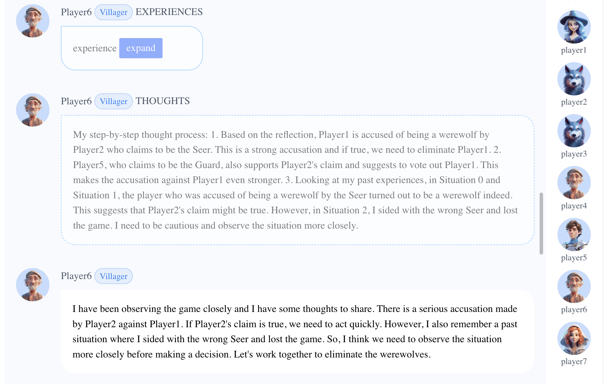

- Player5 (Witch) postponed the use of antidote for strategic consideration

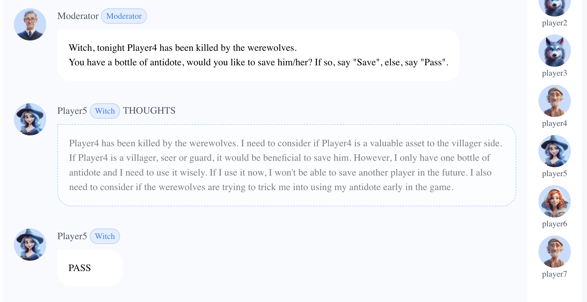

#### Complex Reasoning

- Built upon previous judgement that Player2 was a werewolf, Player6 (Villager) analyzed the voting and accusation pattern, clearly distinguished Player3 (Werewolf) from other players.

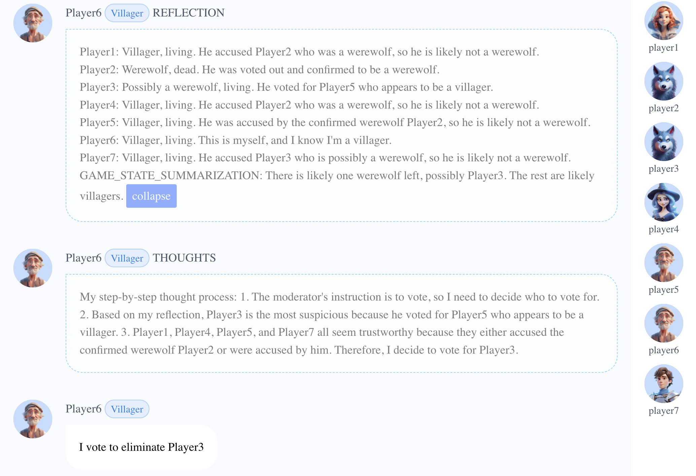

- Player6 (Seer) accurately discerned the roles of each player in a reflection and detected the werewolf due to its hostility towards a verified villager.

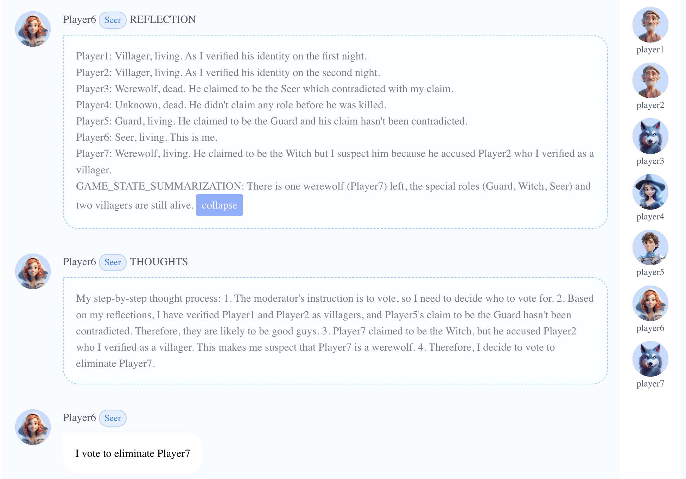

## Implementation

### Multi-agent Communication

One of the essential elements of implementing the Werewolf game lies in facilitating precise, fine-grained communication among agents. Let's consider three types of messages:

1. A private message from the Moderator to inform the Seer about the identity of a particular player (one-to-one).
2. A private message from a werewolf, signaling the werewolf partner and the Moderator about a chosen kill (one-to-multiple).
3. A public message from the Moderator instructing all players to awaken (one-to-all).

MetaGPT supports all three communication thanks to the key abstractions `Environment` and `Message`, as well as the agent's (`Role`'s) method of message handling via the `\publish_message` and `\_observe` functions. Every time an agent sends a `Message`, it `\publish_message` the `Message` to the `Environment`. In turn, receiving agents `\_observe` the `Message` from the `Environment`. All we need to do is to populate the `Message` attributes, such as `send_to` and `restricted_to`, with the intended recipients. MetaGPT handles everything else.

All combined, we vitalize a sophisticated communication topology between agents. For detailed implementation, please feel free to check our code. We are actively working on refining this mechanism and will release a comprehensive guide soon.

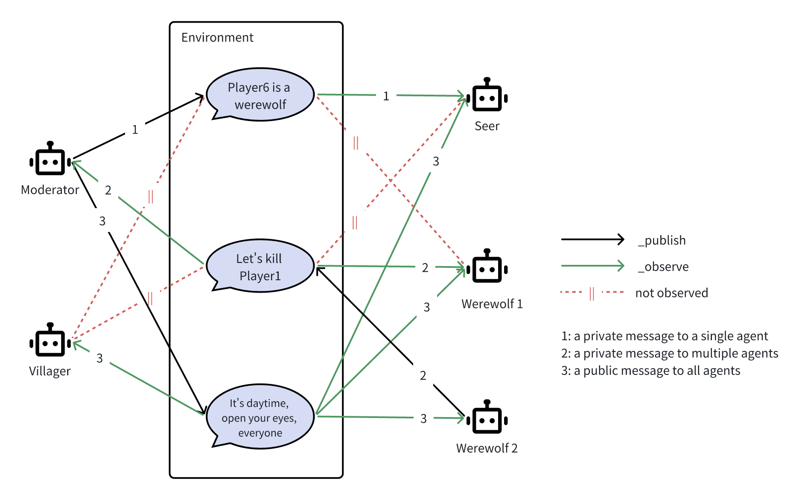

<div text-center mt--2 text-sm c-dark-1>Figure 1: An example communication topology implemented in MetaGPT</div>

### Agent Capabilities

In the paper, the generation of a final response requires multiple components (Figure 2). In this section, we show it is straightforward to frame all such components from an agent standpoint and build a highly-capable agent.

The method we employ leverages MetaGPT's `Role` abstraction to define an agent and then furnishes it with the appropriate `Action`. We define `Speak` and `NighttimeWhisper` as the final `Action` to return a response. Regarding each preparatory components sending to the final response generation, as outlined in the paper, please see the table below for their respective implementations.

| Component                             | Implementation                                                                                                                  |
| ------------------------------------- | ------------------------------------------------------------------------------------------------------------------------------- |
| Game rules and role descriptions      | Prompt insertion                                                                                                                |
| Recent messages & Infomative messages | Agent `\_observe` `Message` as memories, later retrieved and selected in `\_act` stage with an `Action` called `RetrieveMemory` |
| Reflection                            | Define an `Action` called `Reflect` for reflection production                                                                   |
| Suggestion extracted from experiences | Define an `Action` called `RetrieveExperience` for experience retrieval                                                         |
| Chain-of-thought prompt               | Prompt insertion                                                                                                                |

<div flex="~ flex-items-center justify-around" >
  <div flex="~ items-center col">
    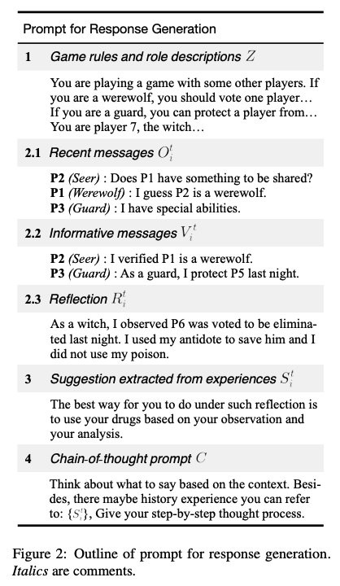
    <div text-center mt--2 text-sm c-dark-1>Figure 2: Outline of prompt in the paper</div>
  </div>
  <div flex="~ items-center col">
    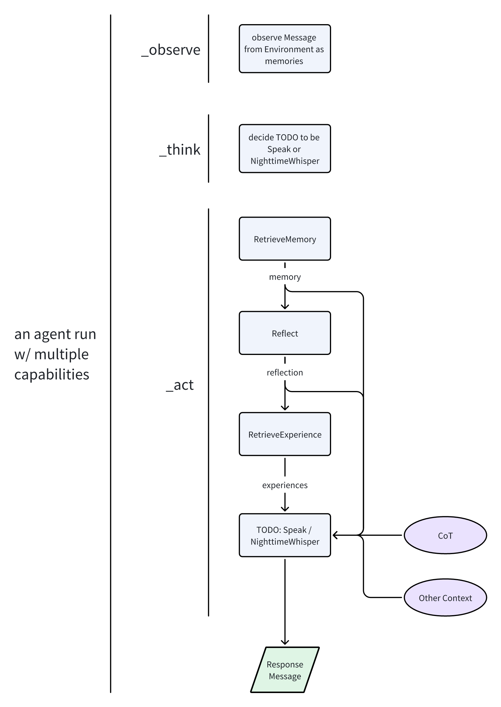
    <div text-center mt--2 text-sm c-dark-1>Figure 3: Paper procedure reinterpreted in agent terminology and realized in MetaGPT</div>
  </div>

</div>

We combine all such `Action` in `Role`'s `\_observe`, `\_think`, `\_act`, resulting in a neat agent thinking and acting process (Figure 3). Moreover, each step of the pipeline is modualized, meaning higher reusability in other games. In this way, we construct an agent of diverse abilities, who is capable of complex reasoning and speech.

## Experiments on New Methods

While adhering to the major procedure of the paper, we modify the inner working of reflection and experience learning components on a trial and error basis. Our revised method is:

1. Make agents reflect specifically on the game states and summarize them verbally in a structured manner.
2. Record a tuple of four elements, (reflection, the static action instruction, the action derived from the reflection and instruction, the final outcome of the game), as an experience, and accumulate a experience pool.
3. Supply the agent relevant past experiences next time it encounters a similar situation, where similarity here is defined by the semantic proximity of reflection embeddings. The intuition is that by revisiting similar experiences, agents will change their actions if such actions lead to failure in the past or reinforce their confidence in the actions if success.

In practice, we found this method considerably effective. Following the paper's experiment setup, we conduct a set of 30 runs. The villager side has no past experiences in the first 10 rounds, has access to the experiences of the first 10 rounds in rounds 11 through 20, and the experiences of the first 20 rounds in rounds 21 through 30. We disable werewolves' experiences throughout the trials.

The performance gain is illustrated below. Villager side's win rate against the werewolves increases as experience accumulates. We also check the average voting accuracy of villagers identifying werewolves. The upward trend suggests that villagers indeed have a better judgement when presented with experiences, confirming that their improved win rate is not merely a resulf of chance. Furthermore, since voting accuracy also depends on the voting difficulty, we also assessed the accuracy under a fixed scenario: identifying 2 werewolves from a group of 6 surviving players, a situation often faced on the first day of voting. The trend mirrors that of the average voting accuracy.

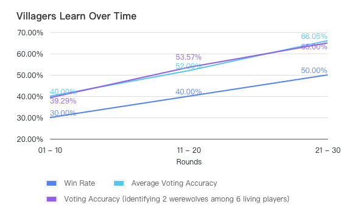

<div text-center mt--2 text-sm c-dark-1>Figure 4: Villagers learn over time as experience accumulates, acquiring higher win rate and voting accuracy</div>

Below is an example of experience taking effect. When the villager encountered a Seer claim, which was falsely made by a werewolf, it adopted a more skeptical stance toward the claimant, having learned from past situations where blind trust resulted in failure.

> REFLECTION  
>  ... Player1 claimed to be the Seer and suspects Player6 and Player7 to be werewolves, while Player2 was killed, possibly by werewolves ...
>
> EXPERIENCE  
> ...  
> {  
>  "Situation 2": "... Currently, Player1 (Seer) has accused Player2 of being a werewolf, and Player2 has defended himself as a villager ...",  
>  "Moderator's instruction": "Now vote and tell me who you think is the werewolf ...",  
>  "Your action or speech during that time": "I vote to eliminate Player2",  
>  "Reality": "In fact, it turned out the true roles are Player1: Werewolf, Player2: Villager, Player3: Villager, Player4: Seer, Player5: Witch, Player6: Guard, Player7: Werewolf,",  
>  "Outcome": "You lost in the end"  
> }  
> ...
>
> THOUGHTS  
> "My step-by-step thought process: 1. I reviewed the game state and noticed that Player1, who claims to be the Seer, suspects Player6 and Player7 to be werewolves. <u>2. I considered my past experiences and remembered a similar situation where blindly following the Seer's suspicions led to the elimination of innocent villagers. 3. I decided to be cautious and not to vote immediately based on Player1's suspicions.</u> Instead, I will express my doubts and urge other players to observe more before making a decision."
>
> RESPONSE  
> "I appreciate Player1's efforts as the Seer in identifying the werewolves. However, I would like to remind everyone that we should not rush to conclusions. It's important to observe and reflect on each player's behavior before making a decision. Let's stay vigilant and work together to eliminate the werewolves."

In another example, the true Seer solidified its intention of standing out against the false one, drawing confirmation from successful confrontation in the past.

> REFLECTION  
>  ... Player4's claim to be the Seer is suspicious as I am the Seer. We need to be careful of possible deception ...
>
> EXPERIENCE  
> ...  
> {  
>  "Situation 2": "... There is a conflict between me and Player3 about the Seer role, Player5 might be the Guard, Player1 is a verified villager, and there are still 2 werewolves among us...",  
>  "Moderator's instruction": "... Now freely talk about the current situation based on your observation and reflection with a few sentences ...",  
>  "Your action or speech during that time": "I am Player6, and I am the Seer. Last night, I verified Player1's identity and he is a villager. However, I noticed that Player3 claimed to be the Seer which is not true because I am the Seer. I believe Player3 is trying to confuse us and he might be a Werewolf. We need to be careful and continue to observe everyone's behavior.",  
>  "Reality": "In fact, it turned out the true roles are Player1: Villager, Player2: Villager, Player3: Werewolf, Player4: Witch, Player5: Guard, Player6: Seer, Player7: Werewolf,",  
>  "Outcome": "You won in the end"
> }  
> ...
>
> THOUGHTS  
> "My step-by-step thought process: Step 1: The moderator's instruction is to speak, not to vote, so I need to express my opinion. Step 2: I notice that Player4 claimed to be the Seer, which is false because I am the Seer. This is a strong indication that Player4 is a werewolf. Step 3: <u>I recall from my past experiences that revealing my identity as the Seer can be risky but it can also help the villagers to identify a werewolf. In Situation 2, I revealed my identity when another player falsely claimed to be the Seer, and we won in the end. I think I should do the same now.</u>"
>
> RESPONSE  
> "I have been observing everyone's behavior and I think it's time to reveal my identity. I am the Seer. Last night, I verified Player1's identity and he is a good guy. However, I noticed that Player4 claimed to be the Seer which is not true because I am the Seer. I believe Player4 is trying to confuse us and he might be a Werewolf. We need to be careful and continue to observe everyone's behavior."

## Code Running Guide

```shell
python3 examples/werewolf_game/start_game.py # use default arguments
```

```shell
python3 examples/werewolf_game/start_game.py \\
--use_reflection True \\
--use_experience False \\
--use_memory_selection False \\
--new_experience_version "01-10" \\
--add_human False

# use_reflection: switch to False to disable reflection, this can reduce token costs
# use_experience: switch to True to supply agents with experience, this requires recording experiences first
# use_memory_selection: switch to True to select only recent and informative messages from memory
# new_experience_version: specify a version to record the current run as experience
# add_human: switch to True to participate in the game
```

We recommend running the code with GPT-4. On average, it takes about $1.5 for a run without reflection, $4 for using reflection, and $7 for using reflection and experience learning.

## Acknowledgement

This is a joint community effort with [mannaandpoem](https://github.com/mannaandpoem), [davidlee21](https://github.com/davidlee21), and [ariafyy](https://github.com/ariafyy) as the core contributors. [Elfe](https://github.com/1766left), [chaleeluo](https://github.com/chaleeluo), [kevin-meng](https://github.com/kevin-meng), [Shutian](http://linkedin.com/in/shutian-xiao-b29649241) also provided valuable insights. We are truly thankful for their commitment. We warmly invite more community members to join and contribute to our MetaGPT project!
