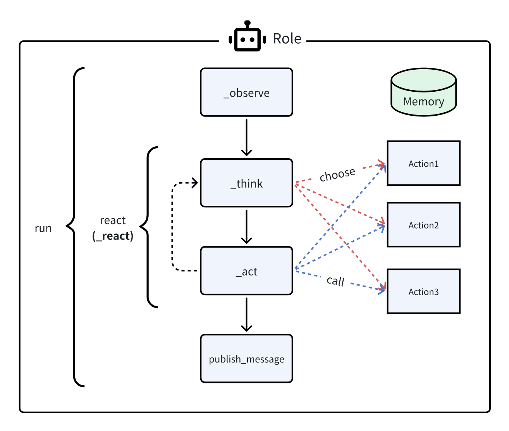
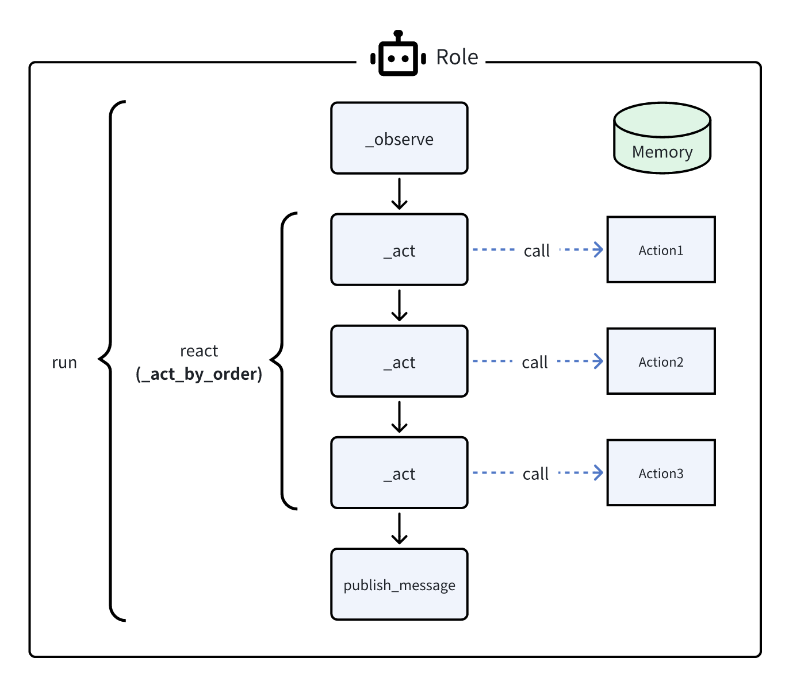

# Think and Act

After this tutorial, you will be able to:

1. Understand how agent thinks and acts in an agent run and what each stage is used for
2. Use different react modes according to your scenarios and need

## Three react modes

After receiving new observation from the environment, an agent starts to "react" to the observation with proper thoughts and actions. The term "react" can be interpreted as "respond" or "reason and act". MetaGPT currently provides two ways to define such thinking and acting process, and will support one more through updates in the near future.

### Standard ReAct (default)

Think first, then act, until the role thinks it is time to stop. This is the standard think-act loop in the [ReAct paper](https://arxiv.org/abs/2210.03629), which alternates thinking and acting in task solving, i.e. `_think` -> `_act` -> `_think` -> `_act` -> ...

Each time during `_think`, `Role` will choose an `Action` to take in response to current observation, and run the chosen `Action` during `_act` stage. The action output will then be new observation used in `_think` again for a next step. We use LLM to select actions in `_think` dynamically, which equips this mode with good generability.



In MetaGPT, `Role` is set up with this mode by default with one think-act loop, so you don't have to specify anything. On the other hand, if you want the `Role` to perform more think-act loops. Use `_set_react_mode` during `Role` initialization. For example, the code below will allow 3 think-act loops (`_think` or `_act` each counts as one loop)

```python
self._set_react_mode(react_mode="react", max_react_loop=6)
```

### By order

Perform capable actions each time by order defined in `set_actions`, i.e. `_act` (Action1) -> `_act` (Action2) -> `_act` (Action3) -> ...

This mode is suitable for a deterministic SOP, where we know exactly what actions a `Role` should take and their order. With this mode, you only need to define the `Action`s and the framework will take over the pipeline building.



Recall our [agent101](agent_101.md) example, by specifying `self._set_react_mode(react_mode="by_order")`, the `Role` will take `SimpleWriteCode` first and `SimpleRunCode` next in its run.

```python
class RunnableCoder(Role):
    name: str = "Alice"
    profile: str = "RunnableCoder"

    def __init__(self, **kwargs):
        super().__init__(**kwargs)
        self.set_actions([SimpleWriteCode, SimpleRunCode])
        self._set_react_mode(react_mode="by_order")

    async def _act(self) -> Message:
        ...
```

### Plan and act

Draft a plan in advance, then use the plan to instruct a series of actions, i.e. `_plan` -> `_act` -> `_act` -> ...


Implementing, stay tuned
