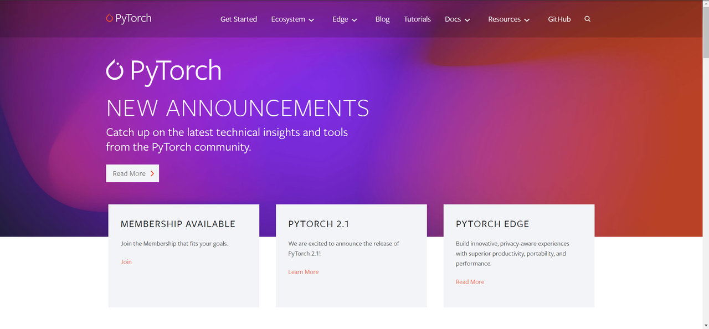

# Tool Usage: Web Page Imitation

## Overview

## Example: Imitating Web Pages Using GPT-4V

### Task

Given a URL or an image of a webpage, use the MetaGPT tool integrated with GPT-4 Vision, GPTvGenerator, to imitate a similar webpage.

### Code

```bash
python examples/ci/imitate_webpage.py
```

### Execution Results

Original webpage screenshot:


Imitated webpages:


## Mechanism Explained

1. When planning tasks, code_interpreter generates several tasks, allocating the tool types for tasks based on the docstring of all registered tools. code_interpreter automatically sets the intermediate task type for generating webpages to "image2webpage", scanning for available tools related to GPTvGenerator when executing tasks.
2. Upon discovering available tools: ['GPTvGenerator'], it loads the tool code, uses the `generate_webpages` method to generate related frontend code according to current needs, and saves them using the `save_webpages` method.
