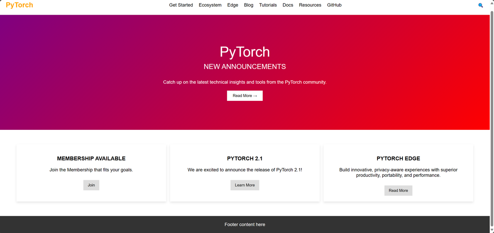

# Tool Usage: Web Page Imitation

## Overview

Webpage imitation involves creating a copy or a similar version of an existing webpage, suitable for various purposes such as functional testing, visual design comparisons, and as an auxiliary tool for teaching webpage design and development. The imitation process includes replicating the layout, style, and content of the target webpage.

## Example: Imitating Web Pages Using GPT-4V

### Task

Given a URL or an image of a webpage, use the MetaGPT tool integrated with GPT-4 Vision, GPTvGenerator, to imitate a similar webpage.

### Code

[examples/di/imitate_webpage.py](https://github.com/geekan/MetaGPT/blob/main/examples/di/imitate_webpage.py)

```bash
python examples/di/imitate_webpage.py
```

### Execution Results

Original webpage screenshot:


Imitated webpages:



## Mechanism Explained

1. When planning tasks, interpreter generates several tasks, allocating the tool types for tasks based on the docstring of all registered tools. interpreter automatically sets the intermediate task type for generating webpages to "image2webpage", scanning for available tools related to GPTvGenerator when executing tasks.
2. Upon discovering available tools: ['GPTvGenerator'], it loads the tool code, uses the `generate_webpages` method to generate related frontend code according to current needs, and saves them using the `save_webpages` method.
