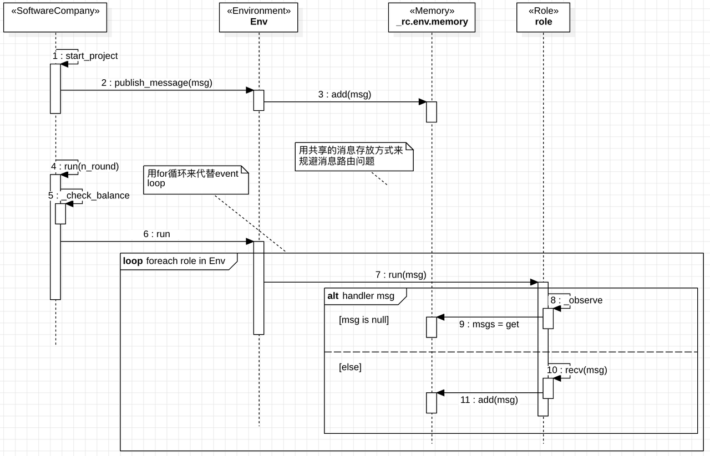
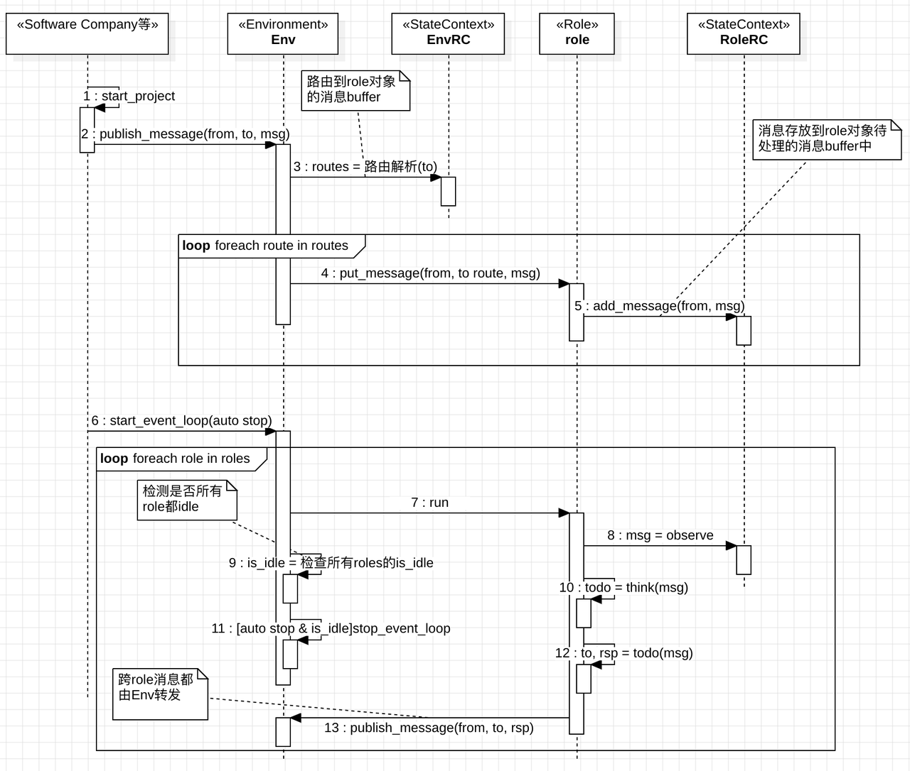
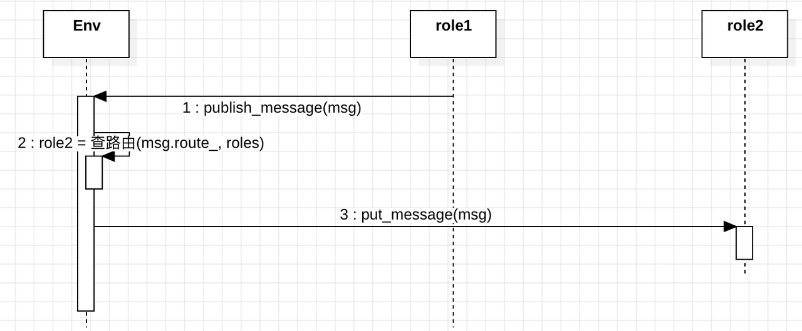

# [R]RFC-116-MetaGPT Role对象间消息机制优化方案

**文档负责人** ：马莘权

1. 文档修改记录

| **日期**   | **版本** | **作者** | **修改内容**   |
| ---------- | -------- | -------- | -------------- |
| 2023-10-25 | v1       | 马莘权   | 创建           |
| 2023-11-3  | v2       | 马莘权   | 删掉无用的设计 |

## 1. 引言

### 1.1 背景

鉴于MetaGPT框架已经在软件公司、狼人杀等场景得到应用，希望通过总结现有落地过程中发现的问题，来优化MetaGPT框架设计，以简化后续算法同学、第三方同学的开发工作，简化MetaGPT向Agent的迁移工作。

### 1.2 目标

明确下一步的MetaGPT框架优化方向，以：

1. 简化后续算法同学的开发工作
2. 简化第三方的开发工作
3. 简化MetaGPT向Agent的迁移工作

## 2. 系统设计

### 2.1 系统架构

#### 2.1.1 MetaGPT内部的消息处理

##### 2.1.1.1 现状



现有设计适合简单、轻量的智能体应用。

在处理持续交互、跨网交互方面存在如下问题：

1. 对于多轮场景，超参“n_round”的值难统一、难推荐。比如挖矿场景、软件开发场景。
2. 共享式的消息存放不支持跨网的消息消费；
3. 共享式的消息存放不支持个性化role对象的记忆压缩和信息隔离，如下图所示：


##### 2.1.1.2 新的架构方案

###### 2.1.1.2.1 自适配event loop

新架构中，Env对象的event loop终止的方式为：

1. Env对外提供`is_idle`状态；
2. 外部可通过调Env的stop函数来终止event loop;
3. 外部通过调start函数来启动event loop。start参数中可指定event loop是否在空闲时自动终止。



新架构中：

1. 所有消息均通过`Environment`对象提供的路由功能，将消息存放到各个`Role`对象私有的消息buffer中；
2. 所有状态数据都存放到一个支持序列化和反序列化的`StateContext`对象中；
3. Env对象通过检查内部各个role是否都空闲来判断是否需要结束event loop；
4. 跨role对象的消息转发统一由`Environment`对象负责。

#### 2.1.2 状态数据管理

现状中，并未规范状态数据的存放原则。

新方案中，`Role`对象私用的状态数据统一存放在Role对象自己的`StateContext`对象中；跨`Role`对象的状态数据统一存放在`Environment`对象的`StateContext`对象中。

`Environment`提供`save`和`load`函数，用于对`Environment`对象内部的状态数据存档和恢复。

#### 2.1.3 消息结构

##### 2.1.3.1 现状

现存的消息结构如图所示：


其中：

1. `content`用来存放消息内容；
2. `instruct_content`功能与`content`相同，区别是存放的是结构化的数据。
3. `role`是OPENAI规范中定义的`role`的值，是调LLM的参数的一部分。本质是meta信息的一部分。
4. `cause_by`被同时用作分类（一种meta信息）标签和路由标签：
   ```Python
   async def _observe(self) -> int:
       await super()._observe()
       # accept the very first human instruction (the debate topic) or messages sent (from opponent) to self,
       # disregard own messages from the last round
       self._rc.news = [msg for msg in self._rc.news if msg.cause_by == UserRequirement or msg.send_to == self.name]
       return len(self._rc.news)
   ```
5. `sent_from`被用作展示时显示的发言者信息。本质是meta信息的一部分。
6. `send_to`被用作路由参数，用来在从共享消息队列中筛选发给自己的消息：
   ```Python
   async def _observe(self) -> int:
       await super()._observe()
       self._rc.news = [
           msg for msg in self._rc.news if msg.send_to == self.profile
       ]  # only relevant msgs count as observed news
       return len(self._rc.news)
   ```
7. `restricted_to`被用作群发（一发多）的路由参数，用来从共享消息队列中筛选发给自己的消息：
   ```Python
   async def _think(self):
       news = self._rc.news[0]
       assert news.cause_by == InstructSpeak  # 消息为来自Moderator的指令时，才去做动作
       if not news.restricted_to:
           # 消息接收范围为全体角色的，做公开发言（发表投票观点也算发言）
           self._rc.todo = Speak()
       elif self.profile in news.restricted_to.split(","):
           # FIXME: hard code to split, restricted为"Moderator"或"Moderator,角色profile"
           # Moderator加密发给自己的，意味着要执行角色的特殊动作
           self._rc.todo = self.special_actions[0]()
   ```

##### 2.1.3.2 新的消息结构

新的消息结构如图所示：


其中：

1. 为了支持`Message`类的JSON化，将`cause_by`的类型替换成str，并封装了自动类型转换的功能；
2. 将原来`send_to`的str类型改为`Set`，以支持多标签“或关系”的消息订阅功能。如果`Message`对象在创建时未设置`send_to`的值，则默认是全员可接收（与现有公共memory的效果相同）。
3. 本次修改，MetaGPT的消息处理参照了消息队列的定义，明确了消息的生产和消费关系。

   a. 新框架中，所有`Role`类及其子类都是消费者，它们默认订阅了发送给全员、自己对象的类名字、自己对象的`name`属性值的消息，见缺省的消息订阅标签章。

   b. 所有`Message`对象的创建者都是消息生产者，它们可以通过设置`Message`对象的`send_to`的值来调整让谁来消费这条消息。

下面是一些新Message类的使用示例：

1. 设置`cause_by`属性：

```Python
m = Message(content="a", cause_by=Action)
assert m.cause_by == get_class_name(Action)
assert m.cause_by == any_to_str(Action)
```

2. 设置`sent_from`属性：

```Python
m = Message(content="a", sent_from=Action)
assert m.sent_from == get_class_name(Action)
assert m.sent_from == any_to_str(Action)
```

3. 设置`sent_to`属性：

```Python
m = Message(content="a"， sent_to={"b", Action})
assert m.send_to == {"b", get_class_name(Action)}
assert m.send_to == any_to_str_set({"b", Action})
```

###### 2.1.3.2.1 缺省的消息订阅标签

为了简化业务开发工作，框架默认提供了3种消息订阅标签。
所有`Role`及其子类都已经订阅了这3种标签，开发者可在发消息时直接使用：

1. `Role`对象的`name`属性：对应`Role`类及其子类对象的`name`属性的值。
2. `Role`类的类名：对应任何`Role`类及其子类对象的类名。比如"Architect"类的类名为"metagpt.roles.architect.Architect"。
3. 全员：值为"&lt;all&gt;"。本地所有消费者，都能收到这个消息。

示例如下：

<table >
<tr><td style="width: 800px;">
假设有如下几个`Role类`的子类对象：

1. `Moderator`类对象 `r1`, `r1`.`name`为`a`;
2. `Werewolf`类对象 `r2`, `r2`.`name`为`b`;
3. `Werewolf`类对象 `r3`, `r3`.`name`为`c`;
4. `Villager`类对象 `r4`, `r4`.`name`为`d`;
5. `Villager`类对象 `r5`, `r5`.`name`为`e`;
6. `Seer`类对象 `r6`, `r6`.`name`为`f`;

已知`Environment`类对象`env`：

1. `r1`发消息给所有`Werewolf`类对象：

```Python
env.publish_message(Message(content="...", send_to=Werewolf))
```

这里的`Werewolf`用的就是`Role`类的类名做标签。这个消息的接收者是所有的`Werewolf`类对象。

2. `r1`发消息给`c`和所有`Villager`类对象：

```Python
env.publish_message(Message(content="...", send_to={Villager, "c"}))
```

这里的`Villager`是`Role`类的类名标签，`c`是`Role`对象`r3`的`name`属性。这个消息的接收者是所有`Villager`类对象，以及`name`属性为`c`的`Role`对象`r3`。

3. `r1`发消息给所有对象:

```Python
env.publish_message(Message(content="...", send_to="<all>"))
```

这个消息的接收者为所有群成员。

6. `r1`发消息给`c`, `d`, `e`:

```Python
env.publish_message(Message(content="...", send_to={"c", "d", "e"}))
```

这个消息的接收者为`r3`、`r4`、`r5`。

</td></tr>
</table>

### 2.2 MetaGPT需改造的模块

#### 2.2.1 Message结构

参考`新的消息结构`章节。

新的消息处理框架下，缺省情况下`Role`类对象会收到所有消息(因为缺省的`Message`.`send_to`是全员)。因此`Role`类的`_observe`里需要把自己关注的新增消息过滤出来，并以此判断是否有消息需要处理。

代码如下：

```Python
async def _observe(self) -> int:
    """Prepare new messages for processing from the message buffer and other sources."""
    # Read unprocessed messages from the msg buffer.
    news = self._rc.msg_buffer.pop_all()
    # Store the read messages in your own memory to prevent duplicate processing.
    self._rc.memory.add_batch(news)
    # Filter out messages of interest.
    self._rc.news = [n for n in news if n.cause_by in self._rc.watch]

    # Design Rules:
    # If you need to further categorize Message objects, you can do so using the Message.set_meta function.
    # msg_buffer is a receiving buffer, avoid adding message data and operations to msg_buffer.
    news_text = [f"{i.role}: {i.content[:20]}..." for i in self._rc.news]
    if news_text:
        logger.debug(f"{self._setting} observed: {news_text}")
    return len(self._rc.news)
```

#### 2.2.2 将公共消息存储改造成Role私有的消息存储

1. 取消公共消息存储，改为`Role`私有的消息存储。

```Python
class RoleContext(BaseModel):
    """Role Runtime Context"""
    env: 'Environment' = Field(default=None)
    memory: Memory = Field(default_factory=Memory)
    long_term_memory: LongTermMemory = Field(default_factory=LongTermMemory)
    state: int = Field(default=0)
    todo: Action = Field(default=None)
    watch: set[str] = Field(default_factory=set)
    news: list[Type[Message]] = Field(default=[])
```

`Role`中的所有`self._rc.env.memory`操作变更为`self._rc.memory`操作。

2. 所有消息转发都由`Environment`类的`Env`对象负责。禁止`Role`对象之间通过访问对方的私有消息存储来交换消息。



3. 所有`Role`对象增加一个私有的消息buffer，来接收异步`put_message`写入的消息。`Role`对象的observe操作(observe-think-act)需要同时看消息buffer和memory。

#### 2.2.3 取消超参k

目前流程的终止依靠`Environment`的`run`的超参`k`和`CostManager`的成本超支检查。

```Python
async def run(self, k=1):
    """处理一次所有信息的运行
    Process all Role runs at once
    """
    # while not self.message_queue.empty():
    # message = self.message_queue.get()
    # rsp = await self.manager.handle(message, self)
    # self.message_queue.put(rsp)
    for _ in range(k):
        futures = []
        for role in self.roles.values():
            future = role.run()
            futures.append(future)

        await asyncio.gather(*futures)
```

新的流程终止条件改为所有的`self.roles`对象的`think`都为空（`Role`对象私有的消息buffer为空，且无action），或者成本超支。

#### 2.2.4 规范状态数据的存储

1. 新建一个支持序列化和反序列化`save`/`load`的`StateContext`类
2. 所有状态数据都需要放到这个类对象中。
3. 仅限`Environment`类和`Role`类拥有这个类的对象。
