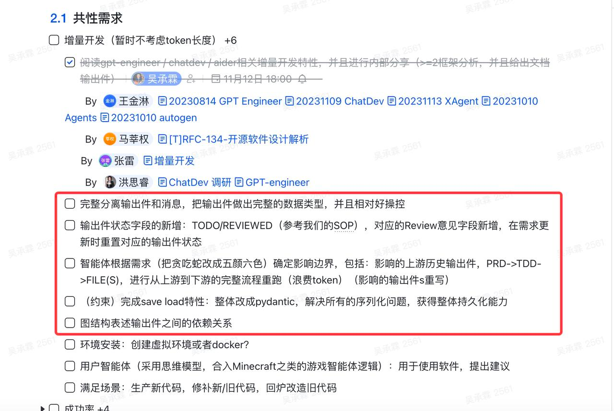
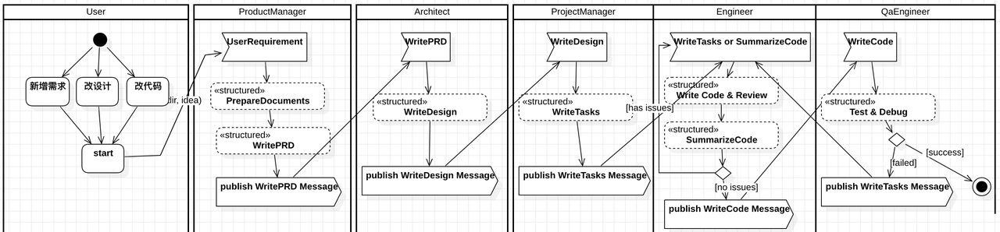
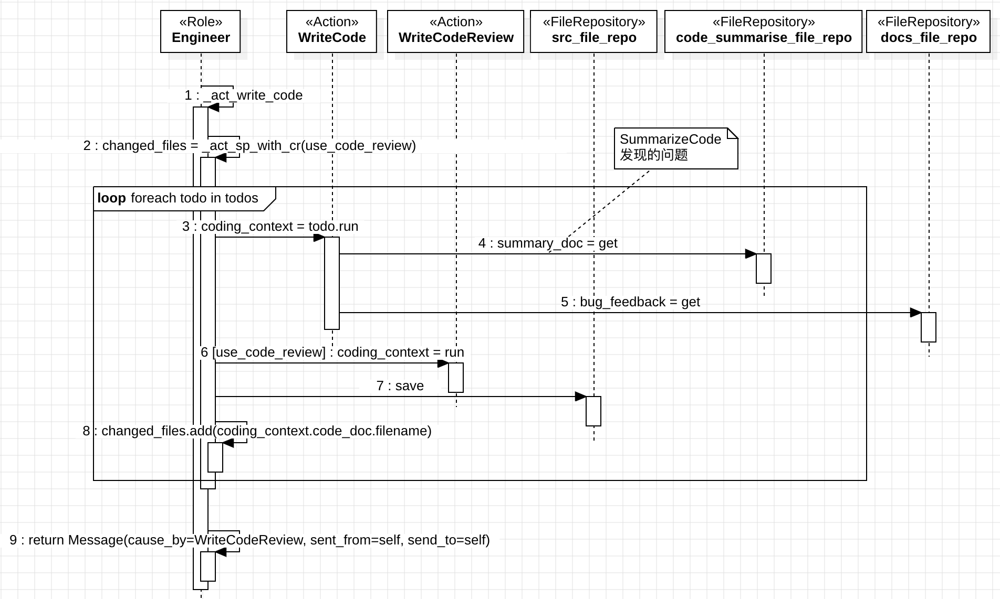

# [R]RFC-135-MetaGPT Software Company增量需求开发方案设计

**文档负责人** ：马莘权

文档修改记录

| 日期       | 版本 | 作者   | 修改内容                                                                                                                                         |
| ---------- | ---- | ------ | ------------------------------------------------------------------------------------------------------------------------------------------------ |
| 2023-11-13 | v1.0 | 马莘权 | 创建                                                                                                                                             |
| 2023-11-16 | v1.1 | 马莘权 | 修改2.2.3 架构变动章节                                                                                                                           |
| 2023-11-17 | v1.2 | 马莘权 | 增加2.2.3.13 输出件和消息分离 章节                                                                                                               |
| 2023-11-23 | v1.3 | 马莘权 | 增加2.2.3.5.1 WriteCode和WriteCodeReview改造                                                                                                     |
| 2023-12-1  | v1.4 | 马莘权 | 更新2.2.3.5 流程变更章节的时序图                                                                                                                 |
| 2023-12-5  | v1.5 | 马莘权 | 更新2.2.3.5.5章节，Engineer增加SummarizeCode环节。                                                                                               |
| 2023-12-13 | v1.6 | 马莘权 | 1. 更新2.2.3.4章节的docs/bugfix.txt<br/>2. 更新2.2.3.5.2章节的WritePRD，新增对bug feedback的处理<br/>3. 更新2.2.3.5.5章节，新增fix bug相关流程。 |

## 1. **引言**

### 1.1 **背景**

现有的MetaGPT的Software Company仅支持从头重新开发软件。
这种软件开发方式：

1. 与实际的软件开发不符。软件开发过程是个反复迭代的过程，通过迭代重新认识需求、对齐目标和优化设计。
2. 用户提出希望Software Company支持增量开发的需求。

### 1.2 **目标**

MetaGPT的Software Company增加在历史版本基础上的增量开发的功能，包括：

1. 多版本管理
2. changelog/diff输出
3. 版本切换



### 1.3 **非目标**

LLM输出结果的优化非本设计的目标。

## 2. **系统设计**

### 2.1 **设计介绍**

#### 2.1.1 **竞品分析**

无

#### 2.1.2 **现状**

MetaGPT Software Company软件开发现有流程如下：


##### 2.1.2.1 **Actions**

###### 2.1.2.1.1 **WritePRD**

输入：原始用户需求，比如说“snake game”

输出：

```json
{
  "Original Requirements": "Create a snake game",
  "Search Information": "",
  "Requirements": "",
  "Product Goals": [
    "Provide an enjoyable gaming experience",
    "Ensure smooth and responsive controls",
    "Include engaging visuals and sound effects"
  ],
  "User Stories": [
    "As a player, I want to control the snake using arrow keys to navigate through the game board",
    "As a player, I want the snake to grow longer and increase in speed as it consumes food",
    "As a player, I want to see my high score and be able to compare it with other players",
    "As a player, I want to have different levels of difficulty to challenge myself",
    "As a player, I want to be able to pause and resume the game at any time"
  ],
  "Competitive Analysis": [
    "Snake Game X has a simple and intuitive user interface",
    "Snake Game Y offers multiple game modes and power-ups",
    "Snake Game Z has a leaderboard feature to compare scores with friends",
    "Snake Game A has smooth and responsive controls",
    "Snake Game B has visually appealing graphics and animations",
    "Snake Game C offers customizable snake skins",
    "Snake Game D has challenging obstacles and mazes"
  ],
  "Competitive Quadrant Chart": "quadrantChart\n title Reach and engagement of snake games\n x-axis Low Reach --> High Reach\n y-axis Low Engagement --> High Engagement\n quadrant-1 Snake Game X: [0.3, 0.6]\n quadrant-2 Snake Game Y: [0.45, 0.23]\n quadrant-3 Snake Game Z: [0.57, 0.69]\n quadrant-4 Snake Game A: [0.78, 0.34]\n Snake Game B: [0.40, 0.34]\n Snake Game C: [0.35, 0.78]\n Snake Game D: [0.5, 0.6]",
  "Requirement Analysis": "",
  "Requirement Pool": [
    [
      "P0",
      "The snake should move smoothly and responsively when controlled by the player."
    ],
    [
      "P1",
      "The game should have different levels of difficulty to cater to players of different skill levels."
    ]
  ],
  "UI Design draft": "The game will have a simple and clean user interface. It will consist of a game board where the snake moves and food appears. The score and high score will be displayed at the top of the screen. There will be buttons to pause and resume the game. The snake and food will have visually appealing graphics.",
  "Anything UNCLEAR": ""
}
```

###### 2.1.2.1.2 **WriteDesign**

输入：WritePRD输出
输出：

````text
{
  "Implementation approach": "We will use the Pygame library to implement the snake game. Pygame is a popular open-source library for game development in Python. It provides a simple and intuitive API for handling graphics, sound, and user input. Pygame also has good documentation and a large community, making it easy to find resources and support. Additionally, we will follow the PEP8 coding style guidelines to ensure clean and readable code.",
  "Python package name": "snake_game",
  "File list": ["main.py"],
  "Data structures and interface definitions": ```
    classDiagram
    class Game{
      -int score
      -Snake snake
      -Food food
      +start_game() : void
      +end_game() : void
      +pause_game() : void
      +resume_game() : void
      +move_snake(direction: str) : void
      +eat_food() : void
      +update_score() : void
    }

    class Snake{
      -List[Tuple[int, int]] body
      -str direction
      +move() : void
      +change_direction(new_direction: str) : void
      +grow() : void
      +collides_with_self() : bool
      +collides_with_food(food_position: Tuple[int, int]) : bool
    }

    class Food{
      -Tuple[int, int] position
      +generate() : void
      +get_position() : Tuple[int, int]
    }

    Game "1" -- "1" Snake: has
    Game "1" -- "1" Food: has
    ```,
  "Program call flow": ```
    sequenceDiagram
    participant M as Main
    participant G as Game
    participant S as Snake
    participant F as Food

    M->>G: start_game()
    G->>S: move_snake(direction)
    S->>S: move()
    S-->>G: move_snake()
    G->>S: eat_food()
    S->>S: grow()
    S->>S: [asdfsa]collides_with_self(asdf)
    S->>F: collides_with_food()
    F->>F: generate()
    G->>G: update_score()
    G->>M: end_game()
    G->>M: pause_game()
    G->>M: resume_game()
    ```,
  "Anything UNCLEAR": "The requirements are clear to me."
}
````

其中：<br/>
&nbsp;&nbsp;&nbsp;&nbsp;a. `classDiagram`使用的是[mermaid](https://github.com/mermaid-js/mermaid/blob/develop/README.zh-CN.md)类视图语法；<br/>
&nbsp;&nbsp;&nbsp;&nbsp;b. `sequenceDiagram`使用的是[mermaid](https://github.com/mermaid-js/mermaid/blob/develop/README.zh-CN.md)时序图语法;<br/>
&nbsp;&nbsp;&nbsp;&nbsp;c. `metagpt/actions/design_api.py`的`_save`中，用`recreate_workspace`函数清空了输出文件夹。

输出文件：

1. `workspace/snake_game/docs/prd.md`

```markdown
## Original Requirements

Design a snake game

## Product Goals

- Provide an engaging and addictive gameplay experience
- Offer intuitive controls for easy navigation
- Include various levels of difficulty to cater to different players

## User Stories

- As a player, I want to control the snake's movement using arrow keys
- As a player, I want to see my score increase as I eat the food
- As a player, I want to challenge myself with different levels of difficulty
- As a player, I want to compete with my friends for the highest score
- As a player, I want to be able to pause and resume the game

## Competitive Analysis

- Snake Game X has a simple and intuitive user interface
- Snake Game Y offers multiple game modes and power-ups
- Snake Game Z has a leaderboard feature for competitive play
- Snake Game A has smooth and responsive controls
- Snake Game B provides customizable snake skins
- Snake Game C offers different themes and backgrounds
- Snake Game D has a tutorial mode for beginners

## Competitive Quadrant Chart

quadrantChart  
 title Reach and engagement of snake games  
 x-axis Low Reach --> High Reach  
 y-axis Low Engagement --> High Engagement  
 quadrant-1 Expand  
 quadrant-2 Promote  
 quadrant-3 Re-evaluate  
 quadrant-4 Improve  
 Snake Game X: [0.6, 0.7]  
 Snake Game Y: [0.8, 0.5]  
 Snake Game Z: [0.7, 0.8]  
 Snake Game A: [0.6, 0.6]  
 Snake Game B: [0.5, 0.6]  
 Snake Game C: [0.4, 0.5]  
 Snake Game D: [0.5, 0.4]  
 Our Target Game: [0.7, 0.7]

## Requirement Analysis

## Requirement Pool

- ['P0', 'The snake should move smoothly and responsively']
- ['P1', 'The game should have multiple levels of difficulty']
- ['P2', 'The game should have a leaderboard feature for competitive play']

## UI Design draft

The game will have a simple and clean user interface. It will consist of a game board where the snake and food will be displayed. The score will be shown at the top of the screen. The controls will be arrow keys for movement. The game board will have a grid layout to represent the snake's movement. The colors used will be vibrant and visually appealing. The UI will be designed to be intuitive and easy to navigate.

## Anything UNCLEAR
```

2. `workspace/snake_game/resources/competitive_analysis.mmd`

```text
quadrantChart
    title Reach and engagement of snake games
    x-axis Low Reach --> High Reach
    y-axis Low Engagement --> High Engagement
    quadrant-1 Expand
    quadrant-2 Promote
    quadrant-3 Re-evaluate
    quadrant-4 Improve
    Snake Game X: [0.6, 0.7]
    Snake Game Y: [0.8, 0.5]
    Snake Game Z: [0.7, 0.8]
    Snake Game A: [0.6, 0.6]
    Snake Game B: [0.5, 0.6]
    Snake Game C: [0.4, 0.5]
    Snake Game D: [0.5, 0.4]
    Our Target Game: [0.7, 0.7]
```

3. `workspace/snake_game/resources/data_api_design.mmd`

```text
classDiagram
    class Game{
        -int score
        -Snake snake
        -Food food
        +start_game() : void
        +end_game() : void
        +pause_game() : void
        +resume_game() : void
        +move_snake(direction: str) : void
        +eat_food() : void
        +update_score() : void
    }

    class Snake{
        -List[Tuple[int, int]] body
        -str direction
        +move() : void
        +change_direction(new_direction: str) : void
        +grow() : void
        +collides_with_self() : bool
        +collides_with_food(food_position: Tuple[int, int]) : bool
    }

    class Food{
        -Tuple[int, int] position
        +generate() : void
        +get_position() : Tuple[int, int]
    }

    Game "1" -- "1" Snake: has
    Game "1" -- "1" Food: has
```

4. `workspace/snake_game/resources/seq_flow.mmd`

```text
sequenceDiagram
    participant M as Main
    participant G as Game
    participant S as Snake
    participant F as Food

    M->>G: start_game()
    G->>S: move_snake(direction)
    S->>S: move()
    S-->>G: move_snake()
    G->>S: eat_food()
    S->>S: grow()
    S->>S: collides_with_self()
    S->>F: collides_with_food()
    F->>F: generate()
    G->>G: update_score()
    G->>M: end_game()
    G->>M: pause_game()
    G->>M: resume_game()
```

5. `workspace/snake_game/docs/system_design.md`

```markdown
## Implementation approach

We will use the Pygame library to implement the snake game. Pygame is a popular open-source library for game development in Python. It provides a simple and intuitive API for handling graphics, sound, and user input. Pygame also has good documentation and a large community, making it easy to find resources and support. Additionally, we will follow the PEP8 coding style guidelines to ensure clean and readable code.

## Python package name

snake_game

## File list

- main.py

## Data structures and interface definitions

    classDiagram
        class Game{
            -int score
            -Snake snake
            -Food food
            +start_game() : void
            +end_game() : void
            +pause_game() : void
            +resume_game() : void
            +move_snake(direction: str) : void
            +eat_food() : void
            +update_score() : void
        }

        class Snake{
            -List[Tuple[int, int]] body
            -str direction
            +move() : void
            +change_direction(new_direction: str) : void
            +grow() : void
            +collides_with_self() : bool
            +collides_with_food(food_position: Tuple[int, int]) : bool
        }

        class Food{
            -Tuple[int, int] position
            +generate() : void
            +get_position() : Tuple[int, int]
        }

        Game "1" -- "1" Snake: has
        Game "1" -- "1" Food: has

## Program call flow

    sequenceDiagram
        participant M as Main
        participant G as Game
        participant S as Snake
        participant F as Food

        M->>G: start_game()
        G->>S: move_snake(direction)
        S->>S: move()
        S-->>G: move_snake()
        G->>S: eat_food()
        S->>S: grow()
        S->>S: collides_with_self()
        S->>F: collides_with_food()
        F->>F: generate()
        G->>G: update_score()
        G->>M: end_game()
        G->>M: pause_game()
        G->>M: resume_game()

## Anything UNCLEAR

The requirements are clear to me.
```

###### 2.1.2.1.3 **WriteTasks**

输入：WriteDesign输出
输出：

1. `workspace/snake_game/docs/api_spec_and_tasks.md`

````text

{
    "Required Python third-party packages": [
        "pygame==2.0.1"
    ],
    "Required Other language third-party packages": [
        "No third-party ..."
    ],
    "Full API spec": ```
        openapi: 3.0.0
        ...
        description: A JSON object ...
     ```,
    "Logic Analysis": [
        ["main.py", "Game"],
        ["main.py", "Snake"],
        ["main.py", "Food"]
    ],
    "Task list": [
        "main.py"
    ],
    "Shared Knowledge": """
        'main.py' contains the implementation of the Game class, Snake class, and Food class. The Game class is responsible for managing the game flow, including starting, ending, pausing, and resuming the game. The Snake class represents the snake in the game, handling its movement, growth, and collision detection. The Food class represents the food in the game, generating new positions and checking for collisions with the snake.
    """,
    "Anything UNCLEAR": "No unclear points."
}
````

2. `workspace/snake_game/requirements.txt`

```markdown
pygame==2.0.1
```

###### 2.1.2.1.4 **WriteCode**

输入：WriteTasks输出 + WriteDesign输出+ 已有Code memory

````text

{
    "Required Python third-party packages": [
        "pygame==2.0.1"
    ],
    "Required Other language third-party packages": [
        "No third-party ..."
    ],
    "Full API spec": """
        openapi: 3.0.0
        ...
        description: A JSON object ...
     """,
    "Logic Analysis": [
        ["main.py", "Game"],
        ["main.py", "Snake"],
        ["main.py", "Food"]
    ],
    "Task list": [
        "main.py"
    ],
    "Shared Knowledge": """
        'main.py' contains the implementation of the Game class, Snake class, and Food class. The Game class is responsible for managing the game flow, including starting, ending, pausing, and resuming the game. The Snake class represents the snake in the game, handling its movement, growth, and collision detection. The Food class represents the food in the game, generating new positions and checking for collisions with the snake.
    """,
    "Anything UNCLEAR": "No unclear points."
}


{
    "Implementation approach": "We will use the Pygame library to implement the snake game. Pygame is a popular open-source library for game development in Python. It provides a simple and intuitive API for handling graphics, sound, and user input. Pygame also has good documentation and a large community, making it easy to find resources and support. Additionally, we will follow the PEP8 coding style guidelines to ensure clean and readable code.",
    "Python package name": "snake_game",
    "File list": ["main.py"],
    "Data structures and interface definitions": ```
    classDiagram
        class Game{
            -int score
            -Snake snake
            -Food food
            +start_game() : void
            +end_game() : void
            +pause_game() : void
            +resume_game() : void
            +move_snake(direction: str) : void
            +eat_food() : void
            +update_score() : void
        }

        class Snake{
            -List[Tuple[int, int]] body
            -str direction
            +move() : void
            +change_direction(new_direction: str) : void
            +grow() : void
            +collides_with_self() : bool
            +collides_with_food(food_position: Tuple[int, int]) : bool
        }

        class Food{
            -Tuple[int, int] position
            +generate() : void
            +get_position() : Tuple[int, int]
        }

        Game "1" -- "1" Snake: has
        Game "1" -- "1" Food: has
    ```,
    "Program call flow": ```
    sequenceDiagram
        participant M as Main
        participant G as Game
        participant S as Snake
        participant F as Food

        M->>G: start_game()
        G->>S: move_snake(direction)
        S->>S: move()
        S-->>G: move_snake()
        G->>S: eat_food()
        S->>S: grow()
        S->>S: collides_with_self()
        S->>F: collides_with_food()
        F->>F: generate()
        G->>G: update_score()
        G->>M: end_game()
        G->>M: pause_game()
        G->>M: resume_game()
    ```,
    "Anything UNCLEAR": "The requirements are clear to me."
}

-----------
# a.py
....
-----------
# b.py
....
-----------
````

输出：\*.py

```python
"""
main.py
"""

import pygame
import random

class Game:
    def __init__(self):
        self.score = 0
        self.snake = Snake()
        self.food = Food()

    def start_game(self):
        pygame.init()
        self.screen = pygame.display.set_mode((800, 600))
        pygame.display.set_caption("Snake Game")
        self.clock = pygame.time.Clock()
        self.running = True

        while self.running:
            for event in pygame.event.get():
                if event.type == pygame.QUIT:
                    self.end_game()
                elif event.type == pygame.KEYDOWN:
                    if event.key == pygame.K_p:
                        self.pause_game()
                    elif event.key == pygame.K_r:
                        self.resume_game()
                    elif event.key == pygame.K_UP:
                        self.move_snake("UP")
                    elif event.key == pygame.K_DOWN:
                        self.move_snake("DOWN")
                    elif event.key == pygame.K_LEFT:
                        self.move_snake("LEFT")
                    elif event.key == pygame.K_RIGHT:
                        self.move_snake("RIGHT")

            self.screen.fill((0, 0, 0))
            self.snake.move()
            self.check_collision()
            self.draw_snake()
            self.draw_food()
            self.update_score()
            pygame.display.update()
            self.clock.tick(10)

    def end_game(self):
        pygame.quit()
        self.running = False

    def pause_game(self):
        self.running = False

    def resume_game(self):
        self.running = True

    def move_snake(self, direction):
        self.snake.change_direction(direction)

    def eat_food(self):
        self.snake.grow()
        self.food.generate()
        self.score += 1

    def update_score(self):
        font = pygame.font.Font(None, 36)
        text = font.render(f"Score: {self.score}", True, (255, 255, 255))
        self.screen.blit(text, (10, 10))

    def check_collision(self):
        if self.snake.collides_with_self():
            self.end_game()
        elif self.snake.collides_with_food(self.food.get_position()):
            self.eat_food()

    def draw_snake(self):
        for segment in self.snake.body:
            pygame.draw.rect(self.screen, (0, 255, 0), (segment[0], segment[1], 20, 20))

    def draw_food(self):
        pygame.draw.rect(self.screen, (255, 0, 0), (self.food.position[0], self.food.position[1], 20, 20))


class Snake:
    def __init__(self):
        self.body = [(100, 100), (80, 100), (60, 100)]
        self.direction = "RIGHT"

    def move(self):
        if self.direction == "UP":
            head = (self.body[0][0], self.body[0][1] - 20)
        elif self.direction == "DOWN":
            head = (self.body[0][0], self.body[0][1] + 20)
        elif self.direction == "LEFT":
            head = (self.body[0][0] - 20, self.body[0][1])
        elif self.direction == "RIGHT":
            head = (self.body[0][0] + 20, self.body[0][1])

        self.body.insert(0, head)
        self.body.pop()

    def change_direction(self, new_direction):
        if new_direction == "UP" and self.direction != "DOWN":
            self.direction = new_direction
        elif new_direction == "DOWN" and self.direction != "UP":
            self.direction = new_direction
        elif new_direction == "LEFT" and self.direction != "RIGHT":
            self.direction = new_direction
        elif new_direction == "RIGHT" and self.direction != "LEFT":
            self.direction = new_direction

    def grow(self):
        tail = self.body[-1]
        self.body.append(tail)

    def collides_with_self(self):
        head = self.body[0]
        return head in self.body[1:]

    def collides_with_food(self, food_position):
        head = self.body[0]
        return head == food_position


class Food:
    def __init__(self):
        self.position = (random.randint(1, 39) * 20, random.randint(1, 29) * 20)

    def generate(self):
        self.position = (random.randint(1, 39) * 20, random.randint(1, 29) * 20)

    def get_position(self):
        return self.position


if __name__ == "__main__":
    game = Game()
    game.start_game()

```

##### 2.1.2.2 **PRD**

PRD是WritePRD action输出的结果。

PRD的内容包括如下几部分：

<table>
<colgroup>
<col style="width: 21%" />
<col style="width: 9%" />
<col style="width: 68%" />
</colgroup>
<tbody>
<tr class="odd">
<td>字段名</td>
<td>是否可增量修改</td>
<td>字段值示例</td>
</tr>
<tr class="even">
<td>Original Requirements</td>
<td>否</td>
<td>"Create a snake game"</td>
</tr>
<tr class="odd">
<td>Search Information</td>
<td>否</td>
<td>""</td>
</tr>
<tr class="even">
<td>Project Name</td>
<td>否</td>
<td>如果想修改，请通过CLI命令参数 --project-name进行</td>
</tr>
<tr class="odd">
<td>Requirements</td>
<td>否</td>
<td>""</td>
</tr>
<tr class="even">
<td>Product Goals</td>
<td><strong>是</strong></td>
<td>
[<br />
&nbsp;&nbsp;&nbsp;&nbsp;"Provide an enjoyable gaming experience",<br />
&nbsp;&nbsp;&nbsp;&nbsp;"Ensure smooth and responsive controls",<br />
&nbsp;&nbsp;&nbsp;&nbsp;"Include engaging visuals and sound effects"<br />
]</td>
</tr>
<tr class="odd">
<td>User Stories</td>
<td><strong>是</strong></td>
<td>
[<br />
&nbsp;&nbsp;&nbsp;&nbsp;"As a player, I want to control the snake using arrow keys to navigate
through the game board",<br />
&nbsp;&nbsp;&nbsp;&nbsp;"As a player, I want the snake to grow longer and increase in speed as
it consumes food",<br />
&nbsp;&nbsp;&nbsp;&nbsp;"As a player, I want to see my high score and be able to compare it with
other players",<br />
&nbsp;&nbsp;&nbsp;&nbsp;"As a player, I want to have different levels of difficulty to challenge
myself",<br />
&nbsp;&nbsp;&nbsp;&nbsp;"As a player, I want to be able to pause and resume the game at any
time"<br />
]</td>
</tr>
<tr class="even">
<td>Competitive Analysis</td>
<td>否</td>
<td>
[<br />
&nbsp;&nbsp;&nbsp;&nbsp;"Snake Game X has a simple and intuitive user interface",<br />
&nbsp;&nbsp;&nbsp;&nbsp;"Snake Game Y offers multiple game modes and power-ups",<br />
&nbsp;&nbsp;&nbsp;&nbsp;"Snake Game Z has a leaderboard feature to compare scores with
friends",<br />
&nbsp;&nbsp;&nbsp;&nbsp;"Snake Game A has smooth and responsive controls",<br />
&nbsp;&nbsp;&nbsp;&nbsp;"Snake Game B has visually appealing graphics and animations",<br />
&nbsp;&nbsp;&nbsp;&nbsp;"Snake Game C offers customizable snake skins",<br />
&nbsp;&nbsp;&nbsp;&nbsp;"Snake Game D has challenging obstacles and mazes"<br />
]</td>
</tr>
<tr class="odd">
<td>Competitive Quadrant Chart</td>
<td>否</td>
<td>
"quadrantChart\n    title Reach and engagement of snake games\n    x-axis Low Reach --> High Reach\n    y-axis Low Engagement --> High Engagement\n    quadrant-1 Snake Game X: [0.3, 0.6]\n    quadrant-2 Snake Game Y: [0.45, 0.23]\n    quadrant-3 Snake Game Z: [0.57, 0.69]\n    quadrant-4 Snake Game A: [0.78, 0.34]\n    Snake Game B: [0.40, 0.34]\n    Snake Game C: [0.35, 0.78]\n    Snake Game D: [0.5, 0.6]"
</td>
</tr>
<tr class="even">
<td>Requirement Analysis</td>
<td>否</td>
<td>""</td>
</tr>
<tr class="odd">
<td>Requirement Pool</td>
<td><strong>是</strong></td>
<td>
[<br />
&nbsp;&nbsp;&nbsp;&nbsp;[<br />
&nbsp;&nbsp;&nbsp;&nbsp;&nbsp;&nbsp;&nbsp;&nbsp;"P0",<br />
&nbsp;&nbsp;&nbsp;&nbsp;&nbsp;&nbsp;&nbsp;&nbsp;"The snake should move smoothly and responsively when controlled by the
player."<br />
&nbsp;&nbsp;&nbsp;&nbsp;],<br />
&nbsp;&nbsp;&nbsp;&nbsp;[<br />
&nbsp;&nbsp;&nbsp;&nbsp;&nbsp;&nbsp;&nbsp;&nbsp;"P1",<br />
&nbsp;&nbsp;&nbsp;&nbsp;&nbsp;&nbsp;&nbsp;&nbsp;"The game should have different levels of difficulty to cater to players
of different skill levels."<br />
&nbsp;&nbsp;&nbsp;&nbsp;]<br />
]</td>
</tr>
<tr class="even">
<td>UI Design draft</td>
<td><strong>是</strong></td>
<td>
"The game will have a simple and clean user interface. It will consist
of a game board where the snake moves and food appears. The score and
high score will be displayed at the top of the screen. There will be
buttons to pause and resume the game. The snake and food will have
visually appealing graphics."</td>
</tr>
<tr class="odd">
<td>Anything UNCLEAR</td>
<td>否</td>
<td>""</td>
</tr>
</tbody>
</table>

##### 2.1.2.3 **[Mermaid](https://mermaid.js.org/syntax/classDiagram.html)类视图和时序图**

类视图和时序图都是WriteDesign的输出的一部分。

类视图与时序图都使用了基于[Mermaid](https://mermaid.js.org/syntax/classDiagram.html)的纯文本UML语法，它描述了某个use
case下的控制流和数据流。因此，对类视图或时序图的修改，需要同时重写类视图和时序图。

类视图示例：

```text
classDiagram
        class Game{
            -int score
            -Snake snake
            -Food food
            +start_game() : void
            +end_game() : void
            +pause_game() : void
            +resume_game() : void
            +move_snake(direction: str) : void
            +eat_food() : void
            +update_score() : void
        }

        class Snake{
            -List[Tuple[int, int]] body
            -str direction
            +move() : void
            +change_direction(new_direction: str) : void
            +grow() : void
            +collides_with_self() : bool
            +collides_with_food(food_position: Tuple[int, int]) : bool
        }

        class Food{
            -Tuple[int, int] position
            +generate() : void
            +get_position() : Tuple[int, int]
        }

        Game "1" -- "1" Snake: has
        Game "1" -- "1" Food: has
```

时序图示例：

```text
sequenceDiagram
        participant M as Main
        participant G as Game
        participant S as Snake
        participant F as Food

        M->>G: start_game()
        G->>S: move_snake(direction)
        S->>S: move()
        S-->>G: move_snake()
        G->>S: eat_food()
        S->>S: grow()
        S->>S: collides_with_self()
        S->>F: collides_with_food()
        F->>F: generate()
        G->>G: update_score()
        G->>M: end_game()
        G->>M: pause_game()
        G->>M: resume_game()
```

##### 2.1.2.4 **WriteTasks**

WriteTasks的输出定义了类视图中的类对应的文件名。其中，Logic
Analysis中的类名引用的是WriteDesign类视图中的类名。

修改WriteTasks仅能改变要生成那些代码文件的逻辑。

```texg
    "Logic Analysis": [
        ["main.py", "Game"],
        ["main.py", "Snake"],
        ["main.py", "Food"]
    ],
    "Task list": [
        "main.py"
    ],
```

##### 2.1.2.5 **WriteCode和QA**

WriteCode依赖上游的类视图和时序图。
如果人工修改WriteCode的输出代码，那么这种修改必须是基于类视图和时序图的。比如修改代码bug。
QA阶段是对WriteCode的输出进行测试，这里可以增加人机实时交互，以指导AI丰富测试方式和测试方向。
但对于简单的代码而言，重跑QA要比人机交互方式的QA要简单直接。

### 2.2 **系统架构**

#### 2.2.1 **前提约束**

1. MetaGPT的控制台交互方式决定了用户仅能**通过文本方式来发起增量变更**；
2. PRD使用的Mermaid语法缺少Use Case Diagram和Activity
   Diagram描述能力，决定了所开发的**软件复杂度不高**；


#### 2.2.2 **可进行的变更**

基于上面的框架前提约束，再结合`现状`章节中各个action的输入输出关系，Software
Company可支持的变更如下：

1. 在Write PRD阶段，变更：<br/>
   &nbsp;&nbsp;&nbsp;&nbsp;a. `Requirement Pool`（p0)<br/>
   &nbsp;&nbsp;&nbsp;&nbsp;b. `Product Goals`<br/>
   &nbsp;&nbsp;&nbsp;&nbsp;c. `User Stories`<br/>
   &nbsp;&nbsp;&nbsp;&nbsp;d. `UI Design draft`

2. 在Write Design阶段，变更：<br/>
   &nbsp;&nbsp;&nbsp;&nbsp;a. 类视图中的类型、命名、返回值类型等<br/>
   &nbsp;&nbsp;&nbsp;&nbsp;b. 在时序图中变更流程的跳转条件、交互步骤等

3. 在Write Code及其后阶段：<br/>
   &nbsp;&nbsp;&nbsp;&nbsp;a. 重新生成指定文件的代码、QA<br/>
   &nbsp;&nbsp;&nbsp;&nbsp;b. 修改指定文件的代码，并重跑其QA

#### 2.2.3 **架构变动**

##### 2.2.3.1 **变动原则**

1. 将旧框架中Message负责传递数据内容的方式，调整为**用Message来传递参考文件名**，由action从参考文件中加载数据内容的方式；
2. 所有**增量信息**，都先落地成文件，通过**文件名来引用**和使用。
3. **token消耗最小化**。

###### 2.2.3.1.1 **消息编号**

将文件数据从Message内剥离后，会出现消息内容相同但事件意义不同的情况，如下图所示：


为此，在Message中增加id属性，来区分是否是同一个Message。

```python
class Message(BaseModel):
    """list[<role>: <content>]"""

    id: str
    content: str
    instruct_content: BaseModel = Field(default=None)
    role: str = "user"  # system / user / assistant
    cause_by: str = ""
    sent_from: str = ""
    send_to: Set = Field(default_factory={MESSAGE_ROUTE_TO_ALL})
```

##### 2.2.3.2 **`.dependencies.json`文件**

根据本次框架的变动原则，在当前项目的输出根目录下，新增`.dependencies.json`文件。`.dependencies.json`文件可通过`FileReporitory`类访问。关于`FileReporitory`类，参见项目文件夹结构章节。
`.dependencies.json`文件中存放了文件**显式依赖**关系。
其JSON格式如下：

```text
{
    "<child file name>": ["<parent file name1>", "<parent file name2>", ...]
}
```

比如`docs/system_design.md`是`WriteDesign` action根据`docs/prd.md`生成的，所以有这样一条记录：

```text
{
  "docs/system_design.md": ["docs/prd.md"]
}
```

**禁止使用隐性依赖**来描述文件之间的依赖关系。
假如“a”文件依赖“b”、“c”文件；“b”文件依赖“c”文件。
正确的`.dependencies.json`文件内容如下：

```text
{
  "a": ["b", "c"],
  "b": ["c"]
}
```

**不支持隐性依赖**，比如下面这种写法就是错误的：

```text
{
  "a": ["b"],
  "b": ["c"]
}
```

这种写法将被解读为“a”文件依赖“b”文件；“b”文件依赖“c”文件。

##### 2.2.3.3 **项目文件的版本管理**

当用户想在某个项目版本上，继续迭代，那么这个被选中的项目版本就称为“基线版本”。
用户对基线版本的变更可通过两种方式进行：
通过main参数idea，传入增量的需求内容。
直接修改基线版本的项目的文件。
本文设计采用git来管理项目版本（参阅`集成git功能`章节）：

1. 以解决用户在项目迭代过程中的版本管理需求；
2. 方便MetaGPT对用户在基线版本上的修改进行识别：

```shell
>>> from git import Repo
>>> repo_path = '/Users/iorishinier/github/MetaGPT'
>>> repo = Repo(repo_path)
>>> diff = repo.index.diff(None)
>>> for item in diff:
...   print(f"文件：{item.a_path}, 差异：{item.change_type}")
...   print(f"差异内容：\n{item.diff}\n")
...
文件：config/config.yaml, 差异：M
差异内容：


文件：requirements.txt, 差异：M
差异内容：


>>>

```

##### 2.2.3.4 **项目文件夹结构**

| 路径                           | 用户可编辑 | 说明                                                                                  |
| ------------------------------ | ---------- | ------------------------------------------------------------------------------------- |
| .dependencies.json             | 否         | 存储文件间的显式依赖关系                                                              |
| docs/requirement.txt           | 是         | 存放本轮**新增的需求**。项目处理过程中，里面的内容会被拆分、合并到docs/prds/下        |
| docs/bugfix.txt                | 否         | 存放本轮bug feedback信息。<br/>迭代时作将bug feedback为需求输入，不要直接改这个文件。 |
| docs/prds                      | 是         | 项目最终拆分完的需求                                                                  |
| docs/system_designs            | 是         | 项目最终的系统设计                                                                    |
| docs/tasks                     | 是         | 项目的编码任务                                                                        |
| docs/code_summaries            | 是         | 对全部代码的复盘结果                                                                  |
| resources/competitive_analysis | 否         | 竞品分析                                                                              |
| resources/data_api_design      | 否         | 类视图文档                                                                            |
| resources/seq_flow             | 否         | 时序图文档                                                                            |
| resources/system_design        | 否         | 系统设计文档                                                                          |
| resources/prd                  | 否         | PRD文档                                                                               |
| resources/api_spec_and_tasks   | 否         | 编码任务的tasks文档                                                                   |
| tmp                            | 否         | 项目处理过程中生成的中间文件。这些文件不会被git归档。                                 |
| &lt;workspace&gt;              | 是         | 项目源代码文件夹                                                                      |
| tests                          | 是         | 单元测试代码                                                                          |
| test_outputs                   | 否         | 单测执行的结果                                                                        |

##### 2.2.3.5 **流程变更**



整体流程调整:

1. `ProductManager`对象**新增**`PrepareDocuments` Action类；
2. 所有输出文档（不包括代码）均采用**可回溯的文件命名**方式，为防止文件名冲突，**采用（YYYYmmddHHMMSS)时间格式的文件名**。比如：

```shell
docs/prds/202311161517.md
docs/system_designs/202311161517.md
tmp/class_diagrams/202311161517.mmd
tmp/sequence_diagrams/202311161517.mmd
```

3. 项目完整的文件夹结构示例如下所示：
   

对项目文件夹的访问操作将封装成`FileRepository`类。

###### 2.2.3.5.1 **PrepareDocuments**

这个action负责：

1. 如果main参数没有传入`project_path`参数（参阅`新增main参数`章节），那么action需要创建和初始化workspace文件夹、初始化git环境；
2. 将main参数`idea`中的新增需求写入`docs/requirement.txt`
3. 发送`Message`消息，通知`WritePRD` action使用`docs/requirement.txt`和`docs/prds/`处理需求。
4. `WritePRD` action的下游action可通过git head diff（封装在`FileRepository`里）来判断文件是否被修改过。参考下面的示例：

```shell
>>> file_path = 'config/config.yaml'
>>> head_commit = repo.head.commit
>>> file_content = head_commit.tree[file_path].data_stream.read().decode('utf-8')
>>> print(f"HEAD 版本的 {file_path} 内容:\n{file_content}")
HEAD 版本的 config/config.yaml 内容:
# DO NOT MODIFY THIS FILE, create a new key.yaml, define OPENAI_API_KEY.
# The configuration of key.yaml has a higher priority and will not enter git

#### if OpenAI
## The official OPENAI_API_BASE is https://api.openai.com/v1
## If the official OPENAI_API_BASE is not available, we recommend using the [openai-forward](https://github.com/beidongjiedeguang/openai-forward).
## Or, you can configure OPENAI_PROXY to access official OPENAI_API_BASE.
OPENAI_API_BASE: "https://api.openai.com/v1"
#OPENAI_PROXY: "http://127.0.0.1:8118"
#OPENAI_API_KEY: "YOUR_API_KEY"
OPENAI_API_MODEL: "gpt-4"

```

Action结束后，`docs/requirement.txt`可用、workspace可用。


###### 2.2.3.5.2 **WritePRD**

这个action负责：

1. 判断当前的输入是bug feedback还是需求。如果是bug feedback，则发消息给`Engineer` role处理。
2. 判断哪些需求文档需要重写：调LLM判断新增需求与prd是否相关，若相关就rewrite
   prd。


其中：<br/>
&nbsp;&nbsp;&nbsp;&nbsp;a. 文件名优先使用旧文件名。如果没有对应的旧文件，新建时间格式的文件名。这条规则实际上是通过规则来表达dependency，效果等价于`2.2.3.2 .denpendencies.json`文件。<br/>
&nbsp;&nbsp;&nbsp;&nbsp;b. 旧方案中，PRD相关的文档保存被放到了`WriteDesign`中，新方案将功能移到`WritePRD`中。由于新方案允许需求分片处理，因此，原`resources`下的`competitive_analysis.mmd`，改为`resources/competitive_analysis/`下的多个文件；供人阅读的markdown格式的PRD文档放在`resources/prd/`下。

3. 如果没有任何PRD，就使用`docs/requirement.txt`生成一个prd。
4. 等`docs/prds/`下所有文件都与新增需求对比完后，再触发publish message让工作流跳转到下一环节。如此设计是为了给后续做全局优化留空间。

Action结束后，`docs/prds/`可用。


###### 2.2.3.5.3 **`WriteDesign`**

这个action负责：

1. 通过git diff来识别`docs/prds`下哪些PRD文档发生了变动；
2. 通过git diff来识别`docs/system_designs`下那些设计文档发生了变动；
3. 对于那些发生变动的PRD和设计文档，重新生成设计内容；


&nbsp;&nbsp;&nbsp;&nbsp;a. 由于新方案允许需求分片处理，因此：<br/>
&nbsp;&nbsp;&nbsp;&nbsp;&nbsp;&nbsp;&nbsp;&nbsp;i. 原`resources`下的`data_api_design.mmd`改为`resources/data_api_design/`下的多个文件；<br/>
&nbsp;&nbsp;&nbsp;&nbsp;&nbsp;&nbsp;&nbsp;&nbsp;ii. 原`resources`下的`seq_flow.mmd`改为`resources/seq_flow/`下的多个文件；<br/>
&nbsp;&nbsp;&nbsp;&nbsp;&nbsp;&nbsp;&nbsp;&nbsp;iii. 原`docs`下的`system\_design.md`改为`resources/system_design`下的多个文件。<br/>
&nbsp;&nbsp;&nbsp;&nbsp;b. 旧方案与PRD保存相关的操作移到`WritePRD`下。<br/> 4. 等`docs/system_designs/`下所有文件都处理完才发publish message，给后续做全局优化留空间。

Action结束后，`docs/system_designs/`可用。


###### 2.2.3.5.4 **`WriteTasks`**

这个action负责：

1. 根据`docs/system_designs/`下的git head diff识别哪些task文档需要重写；
2. 根据`docs/tasks/`下的git head diff识别哪些task文件被用户修改了，需要重写；
3. 对于那些需要重写的task文档，重新生成task内容；


其中：<br/>
&nbsp;&nbsp;&nbsp;&nbsp;a. 用于`WriteCode`的原始数据文件保存在`docs/tasks/`。<br/>
&nbsp;&nbsp;&nbsp;&nbsp;b. 原流程将task的markdown文档内容保存到`docs/api_spec_and_tasks.md`中，由于新流程支持需求分片，因此将文档分片改放`resource/api_spec_and_tasks/`下；<br/>
&nbsp;&nbsp;&nbsp;&nbsp;c. 原流程会生成`requirements.txt`文件。新流程需要将每个分片生成的`requirements.txt`追加合并到同一个`requirements.txt`中。4. 等`docs/tasks/`下所有文件都处理完才发publish message，给后续做全局优化留空间。
Action结束后，`docs/tasks/`可用。


###### 2.2.3.5.5 **`Engineer`**

`Engineer`的`_observe`需要改造，关于消息内容的处理逻辑移到`_think`中：


其中，`_new_code_actions`流程如下：


`_new_summarize_actions`流程如下：


1. 原流程默认只有一个task文件需要处理，现在默认有多个task文件。因此原流程中到memory中搜`WriteDesign`消息的流程已不适用。
2. 新的流程将 “task文件”、“要写代码的文件”放在同一个`Document`类里，交给一个`WriteCode` action对象去执行。其中，“与task相关的`WriteDesign`设计文件”这个参数通过依赖关系由action对象自行查找。


3. 与旧流程一样，`WriteCode`action需基于已有的代码，来写当前代码。
4. `WriteCode`在写代码时，会参考历史`SummarizeCode`发现的问题和用户反馈的bug feedback。
5. `WriteCode`在保存代码的时候，需要更新文件依赖关系。
6. `WriteCode`在写代码的时候，如果git diff发现code有变更，需要让LLM参考code文件内容进行重写。



2.2.3.5.5.1 **`WriteCode`和`WriteCodeReview`改造**

现有代码中，`WriteCode`和`WriteCodeReview`的传参方式与基类`Action`差异较大：

1. `Action`类的`context`是在创建对象时传入的，而`WriteCode`和`WriteCodeReview`是在`run`时才传参；
2. 根据think-act原则，think阶段就应该定义好act的内容和范围，而不是在act执行过程中动态调整。从这个设计角度出发，用run传context的方式是在运行时才决定工作内容和范围，这与框架的think-act设计原则相违背。

```python
code = await WriteCode().run(context=context_str, filename=todo)
```

```python
rewrite_code = await WriteCodeReview().run(context=context_str, code=code, filename=todo)
```

因此，本轮优化会将WriteCode和WriteCodeReview的传参移到创建对象时。

2.2.3.5.5.2 **`SummarizeCode`**


`SummarizeCode`会根据结果，判断跳转到哪里：

1. 如果代码中仍然存在问题，则发消息给自己，重新进行`WriteCode`；
2. 如果代码没有发现问题，则发消息给`QaEngineer`，进入单测环节；

###### 2.2.3.5.6 **`WriteTest`**

新的流程有两种条件会触发`WriteTest` action：

1. 上游依赖的code文件发生变化；
2. 用户指定重写单测。这种情况下，触发`WriteTest`的消息由上游`Engineer`对象负责发送。

###### 2.2.3.5.7 **QaEngineer & WriteTest & RunCode & DebugCode**

QA过程中伴随有大量的Message传文件内容的操作，已经统一改为传文件名方式。


##### 2.2.3.10 **新增main参数**

| 参数名             | 参数值类型 | 可选/必需 | 说明                                                                                                                                        |
| ------------------ | ---------- | --------- | ------------------------------------------------------------------------------------------------------------------------------------------- |
| `--project-path`   | path       | 可选      | 从哪里加载上个版本的项目文件                                                                                                                |
| `--reqa-file`      | File name  | 可选      | 要重新生成单元测试的文件的名字。基于源代码文件夹的相对路径。例如，对于下图场景中的"main.py"，可以使用以下命令：<br/>`--reqa-file "main.py"` |
| `--project-name`   | str        | 可选      | 指定使用的项目名。项目名需同时遵守文件夹和代码变量命名规则。                                                                                |
| `--inc`/`--no-inc` | bool       | 可选      | 是否采用增量实现需求。`--inc`: 基于`--project-path`增量实现需求更新；`--no-inc`: 如果`--project-path`不空，将清空`--project-path`。         |

##### 2.2.3.11 **集成git功能**

git功能作为skill集成到MetaGPT中，方便后续人机交互。
参阅：[利用python代码操作git - tomjoy - 博客园](https://www.cnblogs.com/guapitomjoy/p/12382605.html)

##### 2.2.3.12 **集成changelog功能**

changelog功能作为skill集成到MetaGPT中，方便后续人机交互。
基于git的changelog生成参阅：[git自动生成changelog及项目版本管理 -
掘金](https://juejin.cn/post/6844904147892830221)

##### 2.2.3.13 **输出件和消息分离**

###### 2.2.3.13.1 **现状**

使用消息来传递所有数据。

###### 2.2.3.13.2 **新方案**

新方案依托FileRepository类和workspace，对消息内容进一步分类，以简化消息的处理逻辑：


如此设计是为了解决如下问题：

1. 简化数据同步逻辑<br/>
   &nbsp;&nbsp;&nbsp;&nbsp;a. 旧方案依靠Message来负责各个数据副本之间的数据同步。这让数据的消费者被无端卷入不必要的数据同步的麻烦。<br/>
   &nbsp;&nbsp;&nbsp;&nbsp;b. 新方案将这类数据剥离出来，成为独立的文件。如此数据的同步问题就简化很多。<br/>
   &nbsp;&nbsp;&nbsp;&nbsp;c. 新方案使得Message能够传输多媒体文件。<br/>
   &nbsp;&nbsp;&nbsp;&nbsp;d. 后续优化会持续将Message事件化，弱化将其作为数据传输手段的设计。


2. 简化数据版本管理和迁移的问题。

## 3. **附录**

### 3.1 **术语及定义**

| 术语     | 定义                                                                         |
| -------- | ---------------------------------------------------------------------------- |
| 基线版本 | 用户想在某个项目版本上，继续迭代，那么这个被选中的项目版本就称为“基线版本”。 |

### 3.2 **参考**

- MetaGPT TODOs
