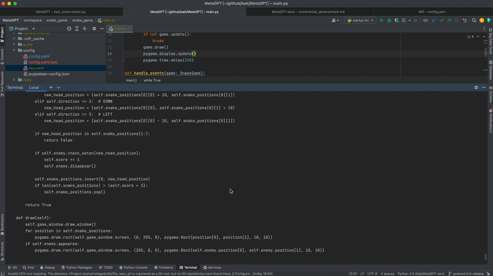
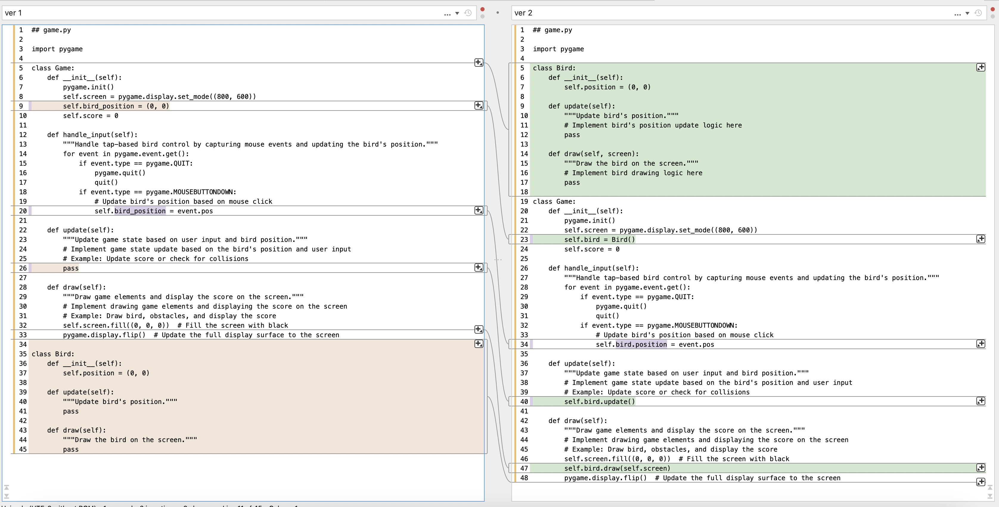
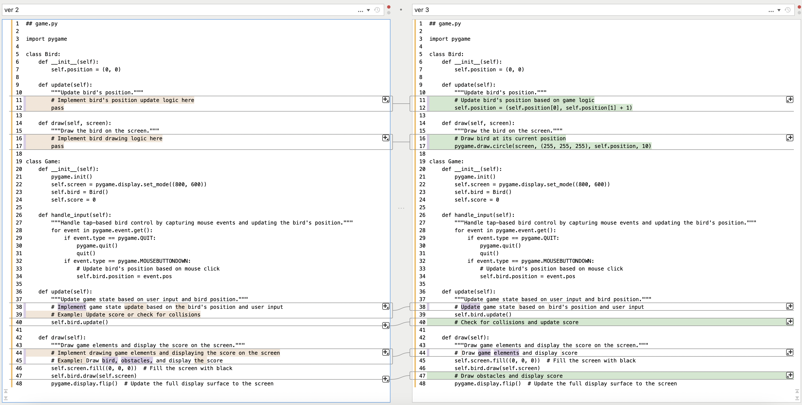
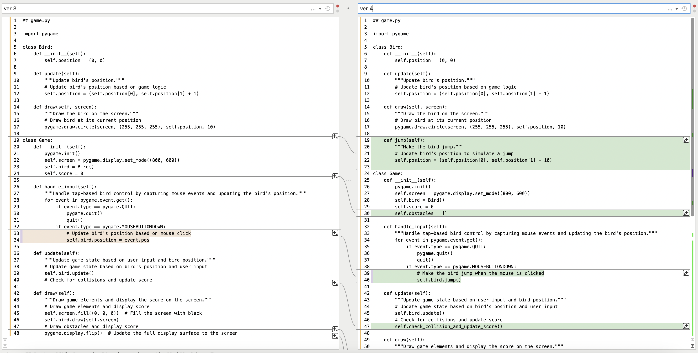
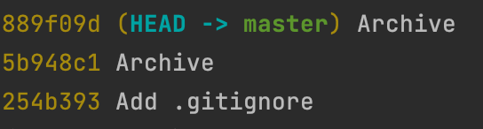
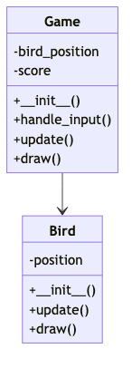
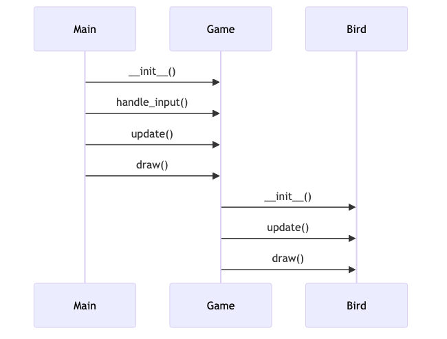
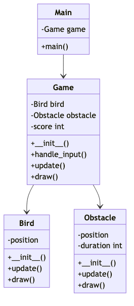
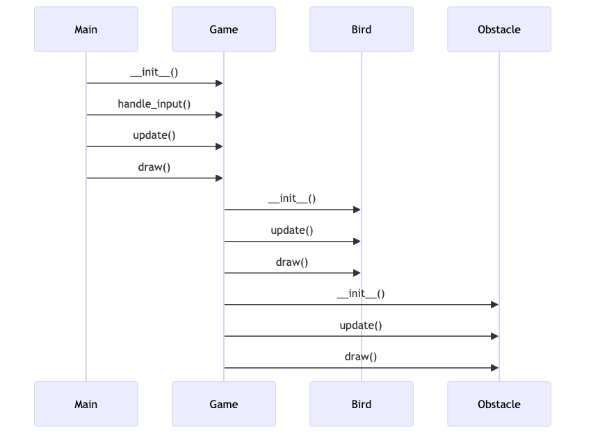

# 增量开发

您可以通过以下步骤改进现有项目代码：

- 在计算机上的任意位置找到您想要改进的由 MetaGPT 创建的项目的文件夹
- 执行 `metagpt <user-requirements-described-in-natural-language-about-new-idea-or-bug-feedback> --project-path <the-project-path-created-by-metagpt>`

---

## metagpt Options

通过使用以下参数，可以连续迭代 MetaGPT 生成的现有项目。

| CLI 参数名称     | 值类型 | 可选/必填 | 描述                                                    | 用法                                                                                                                                                 |
| :--------------- | :----- | :-------- | :------------------------------------------------------ | :--------------------------------------------------------------------------------------------------------------------------------------------------- |
| `--project-path` | TEXT   | Optional  | 指定metagpt创建的旧版本项目的目录路径，以满足增量需求。 | metagpt "BUG_FEEDBACK_XXX" --project-path "YOUR_PROJECT_FULL_PATH"<br/><br/>metagpt "INCREMENT_REQUIREMENTS" --project-path "YOUR_PROJECT_FULL_PATH" |
| `--project-name` | TEXT   | Optional  | 唯一的项目名称，例如“game_2048”。                       | metagpt "NEW_REQUIREMENTS" --project-name "YOUR_PROJECT_NAME"                                                                                        |

有关更多命令选项，请检查 `metagpt --help`.

---

## 演示

以贪吃蛇为例，我们将演示如何增量地进行软件迭代。

### 创建一个新的贪吃蛇游戏项目。

我们使用以下命令参数使用 gpt-4-turbo 创建 Snake 软件项目。

```shell
metagpt "Write a cli snake game based on pygame" --project-name "snake_game" --run-tests --n-round 20 --max-auto-summarize-code 1
```

其中，相关参数的功能说明如下：

| CLI 参数名称              | 值           | 描述                                                   |
| :------------------------ | :----------- | :----------------------------------------------------- |
| --project-name            | "snake_game" | 新创建的软件项目的文件夹名称和项目名称是“snake_game”。 |
| --run-tests               |              | 启用单元测试阶段。                                     |
| --n-round                 | 20           | 进行20轮。                                             |
| --max-auto-summarize-code | 1            | 修复“总结代码”中发现的问题最多允许 1 次。              |

整个流程如下：


---

### 向现有项目添加新需求。

我们使用Azure的GPT-4和以下参数来附加要求：

```shell
metagpt "Add a randomly appearing enemy that lasts for 5 seconds. If the enemy is eaten, the game ends. If the enemy is not eaten, it disappears after 5 seconds." --project-path "/Users/iorishinier/github/bak/MetaGPT/workspace/snake_game" --run-tests --n-round 20 --max-auto-summarize-code 1
```

其中，相关参数的功能说明如下：

| CLI 参数名称              | 值                                                           | 描述                                                                     |
| :------------------------ | :----------------------------------------------------------- | :----------------------------------------------------------------------- |
| --project-path            | "/Users/iorishinier/github/bak/MetaGPT/workspace/snake_game" | Project path of the existing project.                                    |
| --run-tests               |                                                              | Enable the unit testing phase.                                           |
| --n-round                 | 20                                                           | Perform 20 rounds.                                                       |
| --max-auto-summarize-code | 1                                                            | Fixing issues found in the "summarize code" is allowed for up to 1 time. |

整个流程如下：


最终LLM请求代码生成超时，但不会影响项目后续的增量迭代。由于新的需求已经在PRD中累积，重新运行或添加新的需求将基于当前的PRD。

---

### 修复错误

我们使用 Azure 的 GPT-4 和以下参数来修复错误。
为了演示错误修复过程，我们直接将错误代码引入到生成的代码中以触发错误。随后，我们将bug信息作为需求内容的一部分提交，如下图：

```shell
metagpt "TypeError: draw() takes 1 positional argument but 2 were given" --project-path "/Users/iorishinier/github/bak/MetaGPT/workspace/snake_game" --run-tests --n-round 10 --max-auto-summarize-code 0
```

其中，相关参数的功能说明如下：

| CLI 参数名称              | 值                                                           | 描述                             |
| :------------------------ | :----------------------------------------------------------- | :------------------------------- |
| --project-path            | "/Users/iorishinier/github/bak/MetaGPT/workspace/snake_game" | 现有项目的项目路径。             |
| --run-tests               |                                                              | 启用单元测试阶段。               |
| --n-round                 | 10                                                           | 进行 10 轮。                     |
| --max-auto-summarize-code | 0                                                            | 不要修复“总结代码”中发现的问题。 |

整个流程如下：




---

## 未解决的问题

Software Company 是一个实验室项目，旨在展示 MetaGPT 框架的功能，而不是解决生产中的实际问题。因此，MetaGPT Software Company 不支持输入以下性质的新需求：

1. 架构相关的需求，比如setup.py或者requirements.txt怎么写。
2. 指定特定函数应执行特定操作。

其原因如下：

1. 此类“要求”本质上是约束或指示。与真正的需求不同，它们指定系统内某些模块的功能，而不是整个系统的功能。
2. MetaGPT Software公司将软件开发过程简化为类视图和序列图的需求，然后直接翻译成源代码。诸如上述的系统内部模块的设计要求，由于缺乏明确的实现流程，因此被放弃。

---

## 编辑项目文件

您可以通过直接编辑软件公司生成的项目文件来添加新的需求。
对相关文件进行必要的修改后，使用“metagpt”命令启动新一轮的增量迭代。
以下是软件公司生成的文件夹结构的说明。项目迭代期间使用的文件应放置在“docs”目录中。

| 路径                           | 可编辑 | 描述                                                                                                                 |
| ------------------------------ | ------ | -------------------------------------------------------------------------------------------------------------------- |
| .dependencies.json             | No     | 存储文件之间显式的依赖关系。                                                                                         |
| docs/requirement.txt           | No     | 存储本次迭代新添加的需求。在项目处理过程中，里面的内容会被拆分并合并到`docs/prds/`中。请使用metagpt 命令修改此文件。 |
| docs/bugfix.txt                | No     | 存储本轮的bug反馈信息。<br/>在迭代过程中，将bug反馈转化为需求的输入；不要直接修改该文件。                            |
| docs/prds                      | Yes    | 项目需求的最终细目。                                                                                                 |
| docs/system_designs            | Yes    | 该项目的最终系统设计。                                                                                               |
| docs/tasks                     | Yes    | 项目的编码任务。                                                                                                     |
| docs/code_summaries            | Yes    | 整个代码库的审核结果。                                                                                               |
| resources/competitive_analysis | No     | 竞争对手分析                                                                                                         |
| resources/data_api_design      | No     | 类查看文件                                                                                                           |
| resources/seq_flow             | No     | 序列视图文件                                                                                                         |
| resources/system_design        | No     | 系统设计文件                                                                                                         |
| resources/prd                  | No     | PRD 文件                                                                                                             |
| resources/api_spec_and_tasks   | No     | 用于编码的任务文件                                                                                                   |
| tmp                            | No     | 项目处理过程中生成的中间文件。这些文件不会被 git 归档。                                                              |
| &lt;workspace&gt;              | Yes    | 项目源码目录                                                                                                         |
| tests                          | Yes    | 单元测试代码                                                                                                         |
| test_outputs                   | No     | 单元测试执行结果                                                                                                     |

---

## 更多演示

### 愤怒的小鸟游戏

- #### 新项目

使用 gpt-4-turbo 使用以下命令创建一个新的愤怒的小鸟项目：

```shell
metagpt "write a flappy bird game without any obstacles" --project-name "flappy_bird" --run-tests --n-round 20 --max-auto-summarize-code 0
```

<video  controls>
  <source src="../../../public/image/guide/tutorials/inc_req_and_fixbug/20231221-161603.mp4" type="video/mp4">
</video>

- #### 修复错误

使用 azure gpt-4 修复错误：

```shell
metagpt "for event in pygame.event.get(): pygame.error: video system not initialized" --project-path "/Users/iorishinier/github/bak/MetaGPT/workspace/flappy_bird" --run-tests --n-round 20 --max-auto-summarize-code 1
```

<video  controls>
  <source src="../../../public/image/guide/tutorials/inc_req_and_fixbug/20231221-170726.mp4" type="video/mp4">
</video>

通过代码审查我们可以看到game.py不断被重构：



此外，摘要代码操作还指出了通过代码审查未发现的问题，导致game.py进行新一轮的重构：

```text
{
    "game.py": "Implement the 'jump' method in the 'Bird' class, the 'generate_obstacles' method in the 'Game' class, and improve the collision detection in the 'check_collision_and_update_score' method. Also, use the 'obstacles' attribute in the 'Game' class to store and manage the obstacles, and update the score in real-time in the 'draw' method.",
    "main.py": "No changes needed."
}
```


汇总代码动作可以导致源代码无限且持续的重构。但是，我们通过设置“--max-auto-summarize-code 1”将其限制为 1 轮，以展示摘要代码操作的功能。

以下是可用的项目版本：



- #### 添加新依赖
  我们将使用 azure gpt-4 为游戏添加障碍。
  在添加新依赖之前：




```shell
metagpt "Add moving obstacles, move randomly, last for 5 seconds." --project-path "/Users/iorishinier/github/bak/MetaGPT/workspace/flappy_bird" --run-tests --n-round 20 --max-auto-summarize-code 1
```

<video  controls>
  <source src="../../../public/image/guide/tutorials/inc_req_and_fixbug/20231221-193811.mp4" type="video/mp4">
</video>

这是新的类视图和序列视图：



