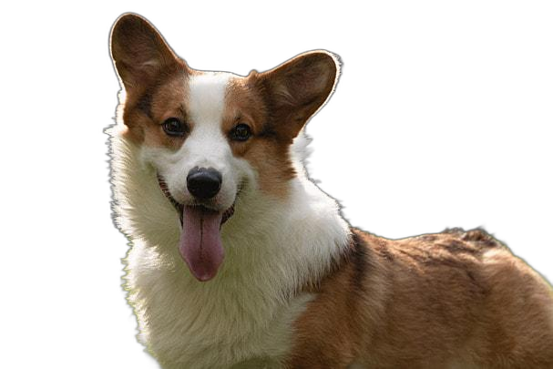

# 图像去背景

## 概述

图像去背景是指将图像中的主要对象与背景分离。它在图像编辑、人物抠图、商品展示和计算机视觉等领域有广泛应用。通过去除背景，可以突出主体对象，提高图像的可视化效果，并为后续处理和分析提供更好的基础。

## 示例

### 任务

使用 `DataInterpreter` 对一张狗狗照片去除背景。

### 代码

[examples/di/rm_image_background.py](https://github.com/geekan/MetaGPT/blob/main/examples/di/rm_image_background.py)

```bash
python examples/di/rm_image_background.py
```

### 运行结果

1. `DataInterpreter` 写的task如下:

```json
[
  {
    "task_id": "1",
    "dependent_task_ids": [],
    "instruction": "Install the rembg package using pip."
  },
  {
    "task_id": "2",
    "dependent_task_ids": ["1"],
    "instruction": "Use the rembg package to remove the background from the image at the specified path."
  },
  {
    "task_id": "3",
    "dependent_task_ids": ["2"],
    "instruction": "Save the image with the background removed to the specified save path."
  }
]
```

`DataInterpreter`能够根据问题划分为合理的`task`，这里可以看到第一步便是安装rembg库。

2. `DataInterpreter` 写的代码如下:

```python
# -----------------------------task1-------------------------------
!pip install rembg
# -----------------------------task2-------------------------------
from rembg import remove
input_path = '/data/luxiangtao/data_agents_opt-code_intepreter/dog.jpg'
output_path = '/data/luxiangtao/data_agents_opt-code_intepreter/dog_rmg.png'

# Read the input image
with open(input_path, 'rb') as i:
    input_image = i.read()

# Remove the background
output_image = remove(input_image)

# ------------------------------task3-------------------------------
# Write the output image
with open(output_path, 'wb') as o:
    o.write(output_image)
```

`rembg`是一个实现自动图像去背景的开源python工具包，且可以在CPU上运行。当我们在requirement中提示使用这个工具包时，`DataInterpreter`能够自动安装这个工具包并正确使用(这很可能是因为LLM在训练时学会了'rembg'这个Python库的使用方法)

这是一张有狗的输入图片以及去除了背景的狗的图片。可以看到背景去除的效果非常好，`DataInterpreter`可以顺利完成这个任务。

<div align=center>
 
 
</div>
